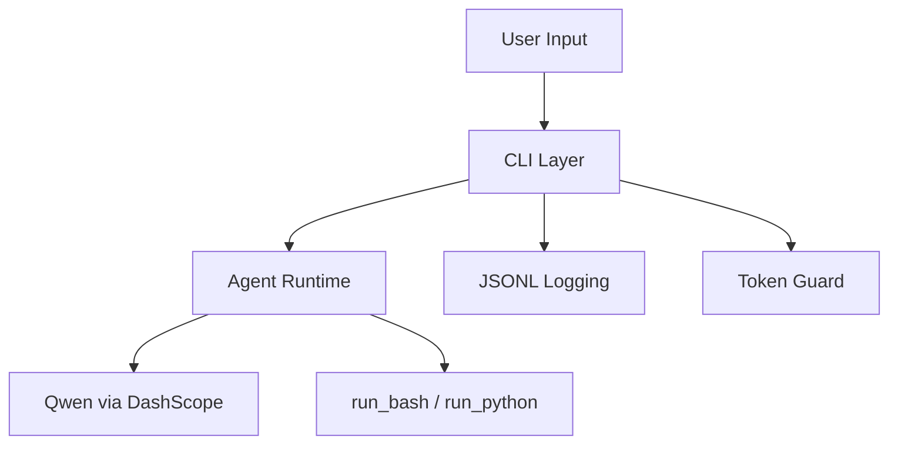

# Agent1

> A production-friendly CLI agent starter powered by Pydantic AI and Qwen.

[](https://www.python.org/)
[](LICENSE)
[](https://docs.astral.sh/uv/)
[](https://www.alibabacloud.com/help/en/model-studio/compatibility-of-openai-with-dashscope)

`agent1` 是一个轻量、可观测、跨平台的命令行智能体工程模板，默认接入阿里云 DashScope（Qwen3.5-plus），并提供工具调用、结构化日志、token 用量监控与预算保护能力。

## Why Agent1

- 开箱即用的 **CLI Agent**（单次/交互、流式/非流式）
- 内置 **工具调用**：Shell 命令与 Python 脚本执行
- 完整 **可观测性**：JSONL 事件日志 + run_id 追踪
- 强化 **成本控制**：每轮展示 token 用量，支持会话预算上限
- **跨平台适配**：macOS / Ubuntu / Windows
- **环境感知提示词**：自动将 OS / Python / Shell / CWD 注入系统提示词

## Table of Contents

- [Quick Start](#quick-start)
- [Configuration](#configuration)
- [Usage](#usage)
- [Architecture](#architecture)
- [Observability](#observability)
- [Cross-platform Behavior](#cross-platform-behavior)
- [Testing](#testing)
- [Project Structure](#project-structure)
- [Roadmap](#roadmap)
- [Contributing](#contributing)
- [License](#license)

## Quick Start

### 1) Install dependencies

```bash
cd agent1
uv sync
```

### 2) Configure model credentials

```bash
export DASHSCOPE_API_KEY="your-api-key"
# or
export ALIBABA_API_KEY="your-api-key"
```

Optional (international endpoint):

```bash
export ALIBABA_BASE_URL="https://dashscope-intl.aliyuncs.com/compatible-mode/v1"
```

### 3) Run

```bash
# streaming single-run
uv run agent1 "列出当前目录文件"

# non-streaming single-run
uv run agent1 "1+1等于几" --no-stream

# interactive session
uv run agent1
```

If installed globally (`uv tool install -e .`), use `agent1` directly.

## Configuration

| Variable | Description | Default |
|---|---|---|
| `DASHSCOPE_API_KEY` / `ALIBABA_API_KEY` | Model API key (one required) | None |
| `ALIBABA_BASE_URL` | DashScope endpoint | `https://dashscope.aliyuncs.com/compatible-mode/v1` |
| `AGENT1_LOG_FILE` | JSONL log file path | `logs/agent1.jsonl` |
| `AGENT1_MAX_TOTAL_TOKENS` | Session token budget guard | Unlimited |

## Usage

### Common workflows

```bash
# ask a coding question
uv run agent1 "帮我写一个读取 JSON 文件并校验字段的 Python 脚本"

# force non-stream mode
uv run agent1 "解释一下这段日志" --no-stream
```

### Session controls

- `Ctrl + C` or `Ctrl + D`: exit interactive mode
- Budget exceeded (`AGENT1_MAX_TOTAL_TOKENS`): session stops automatically

## Architecture



- CLI orchestrates user interaction, status updates, and output rendering
- Agent layer handles prompt, model invocation, and tool orchestration
- Observability layer writes structured events for debugging and auditing

See [Architecture Details](docs/ARCHITECTURE.md) and [Tech Stack](docs/TECH_STACK.md).

## Observability

### Runtime feedback

Terminal output includes:

- request lifecycle status
- tool call / tool result markers
- token usage table (per-run + session cumulative)

### Structured logs (JSONL)

- Default path: `logs/agent1.jsonl`
- Format: one JSON object per line

```bash
tail -f logs/agent1.jsonl
```

Windows PowerShell:

```powershell
Get-Content .\logs\agent1.jsonl -Wait
```

Key event types:

- `run_started`
- `model_request`
- `model_text_delta`
- `tool_call`
- `tool_result`
- `usage`
- `model_response`
- `run_completed` / `run_failed`

## Cross-platform Behavior

- `run_python` uses `sys.executable` to avoid `python` vs `python3` mismatch
- `run_bash` adapts by OS:
  - Windows: prefer `bash` (e.g., Git Bash), then fallback to `powershell` / `pwsh` / `cmd`
  - Linux/macOS: `bash` preferred, fallback to `sh`
- System prompt includes runtime context (OS, Python, Shell, CWD) to reduce invalid command generation

## Testing

Run unit tests:

```bash
PYTHONPATH=src python -m unittest discover -s tests -v
```

The Windows shell adaptation tests are in `tests/test_bash_tool.py`, covering:

- Git Bash preferred on Windows when available
- PowerShell fallback when bash is unavailable
- cmd fallback when neither bash nor PowerShell is available

## Project Structure

```text
agent1/
├── src/agent1/
│   ├── agent.py
│   ├── cli/main.py
│   ├── tools/
│   ├── logging_utils.py
│   └── __init__.py
├── docs/
│   ├── ARCHITECTURE.md
│   └── TECH_STACK.md
├── .github/
│   ├── workflows/ci.yml
│   └── ISSUE_TEMPLATE/
├── pyproject.toml
├── CHANGELOG.md
├── CONTRIBUTING.md
└── LICENSE
```

## Roadmap

- [ ] Add tool safety policies (allowlist / denylist / confirmation layer)
- [ ] Add unit + integration tests
- [ ] Add model fallback and retry strategy
- [ ] Add optional remote log sink integration

## Contributing

Contributions are welcome. Please read [CONTRIBUTING.md](CONTRIBUTING.md) first.

## License

MIT License. See [LICENSE](LICENSE).

---

If this project helps you, a star is appreciated.
