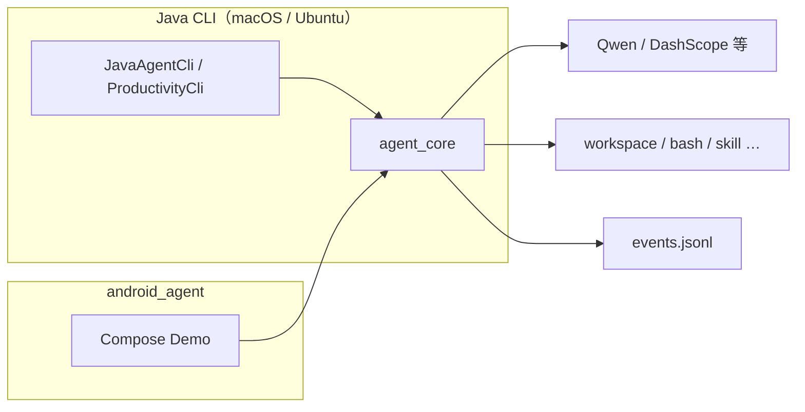

# Agent1

> 面向生产的 JVM 智能体工程：**Java CLI**（macOS / Ubuntu）与 **Android** 宿主共用 `agent_core`，支持工具调用、结构化事件日志与基础运行约束。

[](https://adoptium.net/)
[](LICENSE)
[](https://www.alibabacloud.com/help/en/model-studio/compatibility-of-openai-with-dashscope)

## 项目目标

在 **JVM** 上建立生产力向智能体参考实现：持久会话、工作区沙箱、对话与工具循环、流式输出、JSONL 事件。桌面侧通过 **Java CLI** 在 **macOS 与 Ubuntu** 上运行；移动端通过 **Android** 集成同一核心库。

> **不再维护 Python CLI**。历史代码仅只读保留在 [`archive/python-agent`](https://github.com/fengshihao/agent1/tree/archive/python-agent) 分支；新功能请在 Java / Android 路径开发。

## 核心模块

| 模块 | 是什么 | 典型用途 |
|------|--------|----------|
| **`agent_core`** | JVM **Agent 核心库**（Java 17）：运行时、OpenAI 兼容流式 LLM、工具循环、会话/工作区/事件落盘等。 | 被 `java_agent` 引用；可发布为 `com.agent1:java-agent-core` 供 Android 依赖。 |
| **`java_agent`** | **Gradle 编排 + CLI**：经典 `JavaAgentCli`（bash/python/skill）与 **`--productivity`** 生产力路径（会话、workspace 工具、`events.jsonl`）。 | 本地 CLI、fat-jar、单测。详见 [java_agent/README.md](java_agent/README.md)。 |
| **`android_agent`** | **Android 示例**：动态 UI Demo，依赖已发布的 core。 | `./build-android-agent.sh`（需 adb）。 |

## 当前功能范围

### 生产力路径（`--productivity`，推荐新功能在此演进）

- **会话**：`FileSessionStore`（`meta.json`、`transcript.jsonl`、`workspace/`）
- **工作区工具**：`read_file` / `write_file` / `edit_file` / `list_dir`（沙箱内）
- **上下文**：轮次裁剪、`chat_history` 关键词检索
- **事件**：默认 `~/files/agent/logs/events.jsonl`（可通过 `AGENT1_AGENT_ROOT` 等调整）
- **配置**：`AgentRuntimeConfig` + 环境变量加载

### 经典 Java CLI

- 单次 / 交互、流式 / 非流式；`ReadFileTool`、`RunBashTool`、`RunPythonTool`、`SkillTool`
- 跨平台 shell 适配（含 Windows，但**官方支持平台为 macOS 与 Ubuntu**）

### `android_agent`

- 本地 JSON 动态界面 + Qwen 生成界面；接 core 的多轮对话方向与仓库一致。

---

## 怎么用

### 环境

```bash
export DASHSCOPE_API_KEY="your-key"   # 或 ALIBABA_API_KEY / OPENAI_API_KEY
```

### 测试（Java）

```bash
gradle -p java_agent :core:test :cli:test
```

### Java CLI

```bash
# 生产力助手（推荐）
./agent1                  # 交互
./agent1 你好             # 单次提问
./agent1 models           # 模型与运行时参数
./agent1 logs failed      # 查事件日志

# 经典 CLI（bash/python/skill）
./run-java-agent "列出当前目录文件"
# 或跳过 fat-jar、直接 Gradle：
./run-java-agent-gradle "列出当前目录文件"
```

发布 core 给 Android：

```bash
./publish-java-agent-core.sh
```

能力跟踪与落地顺序见 **[doc/基础能力/README.md](doc/基础能力/README.md)**。

---

## 环境变量（摘要）

| Variable | Description |
|---|---|
| `DASHSCOPE_API_KEY` / `ALIBABA_API_KEY` | 模型 API Key |
| `ALIBABA_BASE_URL` / `OPENAI_BASE_URL` | OpenAI 兼容基地址 |
| `AGENT1_AGENT_ROOT` | 会话与日志数据根（生产力路径） |
| `AGENT1_MAX_CONTEXT_TURNS` 等 | 见 `AgentRuntimeDefaults` 与 [doc/基础能力/13-配置.md](doc/基础能力/13-配置.md) |

经典 CLI 另有 `AGENT1_MAX_CONTEXT_MESSAGES`、`AGENT1_LOG_FILE` 等，见 [java_agent/README.md](java_agent/README.md)。

## 架构示意



## 仓库目录结构

```text
<repo>/
├── agent_core/           # JVM 核心库
├── java_agent/           # CLI + Gradle
├── android_agent/        # Android Demo
├── doc/基础能力/         # 能力跟踪文档
├── agent1                # 生产力助手 CLI 入口
├── run-java-agent
├── run-java-agent-gradle
├── publish-java-agent-core.sh
├── build-android-agent.sh
└── …
```

## 规划与路线图

- 按 [doc/基础能力/](doc/基础能力/) 补齐 02 运行恢复、05 日志查询、07 界面、03 子智能体、12 weizhi 脚本接口等
- 沙盒、工具策略、MCP、长期记忆等为后续方向（见各能力文档「非目标 / 以后」）

## Contributing

请先阅读 [CONTRIBUTING.md](CONTRIBUTING.md)。

## License

MIT License. See [LICENSE](LICENSE).
