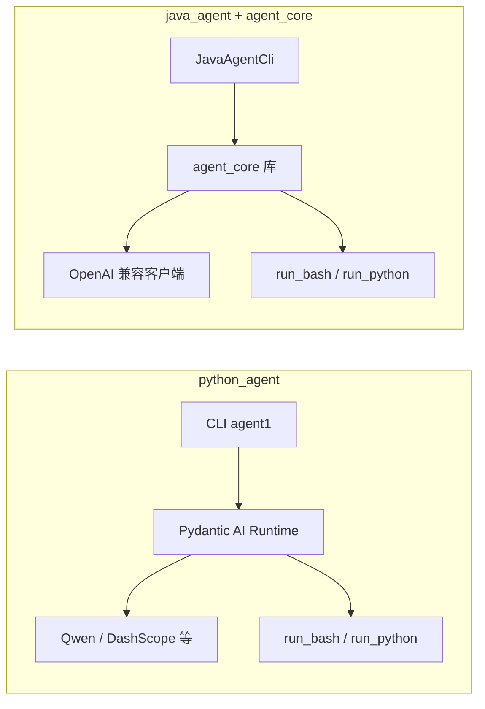

# Agent1

> 面向生产的通用 Agent 工程：同一套能力在 **Java** 与 **Python** 两条栈上各有一份可运行实现，便于在服务端、桌面 CLI、以及 JVM 生态（含 Android）中复用。

[](https://www.python.org/)
[](LICENSE)
[](https://docs.astral.sh/uv/)
[](https://www.alibabacloud.com/help/en/model-studio/compatibility-of-openai-with-dashscope)

## 项目目标

建立 **Java 版** 与 **Python 版** 的通用智能体（Agent）参考实现：支持对话、工具调用、流式输出、可观测日志与基础成本控制，默认可对接阿里云 DashScope（OpenAI 兼容模式）等端点。两条实现能力对齐、接口习惯接近，便于按团队技术栈选型或混合部署。

## 三个核心模块分别是什么

| 模块 | 是什么 | 典型用途 |
|------|--------|----------|
| **`agent_core`** | JVM 上的 **Agent 核心库**（Java 17）。包含状态化运行时、OpenAI 兼容流式 LLM 客户端、工具循环、事件流、ASR 等能力；**不是**独立可执行的 CLI。 | 被 `java_agent` 以 Gradle 子工程 `:core` 引用；也可发布为 Maven 构件（`com.agent1:java-agent-core`）供 Android 或其它 Java/Kotlin 应用依赖。 |
| **`java_agent`** | **Java 命令行与构建编排**：Gradle 多模块工程，`cli` 模块提供与 Python 版类似的终端体验（单次/交互、流式/非流式、JSONL 日志等）。 | 本地跑 Java CLI、打 fat-jar、对 `agent_core` 跑测试、发布 core 到本地 Maven 等。详见 [java_agent/README.md](java_agent/README.md)。 |
| **`python_agent`** | **Python 命令行智能体**（Pydantic AI），包名/CLI 为 `agent1`：工具调用、Rich 终端、JSONL、token 预算等。 | 用 `uv` 安装依赖并直接 `uv run agent1`；也支持一键安装脚本。详见 [python_agent/README.md](python_agent/README.md)。 |

关系简述：`agent_core` 是库；`java_agent` 的 `cli` 依赖该库并暴露可执行入口；`python_agent` 是平行实现，不依赖 JVM。

## 当前功能范围

以下为**截至本仓库当前实现**的能力边界（`python_agent` / `java_agent` / `agent_core` / 可选 `android_agent`），便于与下文「规划」区分。

### `python_agent`（CLI `agent1`）

- **对话**：单次提问、交互多轮；流式 / 非流式输出；工作区为当前目录的「薄运行时」封装。
- **模型**：OpenAI 兼容 API（默认对接 DashScope / Qwen 等，可换 base URL）。
- **工具**：`read_file`（工作区范围内读文件）、`run_bash`、`run_python`、**Skill 工具**（与 Java 侧思路对齐：发现 `.claude/skills`、安装/卸载等，部分能力依赖本机 `git`）。
- **约束与成本**：可配置单轮工具调用上限、会话 token 预算（`AGENT1_MAX_TOTAL_TOKENS` 等）。
- **可观测**：Rich 终端展示 + JSONL 结构化事件（run / model / tool / usage 等）。
- **跨平台**：Shell 与 Python 启动方式按操作系统适配；系统提示词注入 OS / Shell / CWD 等上下文。

### `java_agent`（CLI，依赖 `agent_core`）

- **对话**：与 Python CLI 类似的单次 / 交互、流式 / 非流式体验。
- **模型**：`agent_core` 内 OpenAI 兼容流式客户端（DashScope / OpenAI 等）。
- **工具**：`ReadFileTool`、`RunBashTool`、`RunPythonTool`、**`SkillTool`**（Claude Code 风格 SKILL.md、`/skill` 触发等，见 [java_agent/README.md](java_agent/README.md)）。
- **约束与成本**：如发往模型的上下文条数上限（`AGENT1_MAX_CONTEXT_MESSAGES`）、日志路径等。
- **可观测**：终端状态 + 与 Python 侧同风格的 JSONL 事件类型。

### `agent_core`（JVM 库，无独立 CLI）

- **Agent 运行时**：状态化消息与工具循环、`continueRun` / `abort` / `waitForIdle`、事件流（便于 UI 或编排层订阅）。
- **LLM**：OpenAI 兼容 SSE 流式调用。
- **语音（ASR）**：阿里云 DashScope 等 ASR 客户端能力（供集成方在语音场景使用）。
- **依赖面**：OkHttp、Jackson、RxJava 等；**无** Spring / Reactor，便于 Android 与服务端共用同一核心构件。

### `android_agent`（可选示例应用）

- **定位**：依赖已发布的 `java-agent-core`，演示在移动端集成语音、无障碍上下文、业务工具等（**非**与 CLI 1:1 的功能对齐表）；具体以 `android_agent` 内实现为准。

---

## 怎么用

### `agent_core`（作为库 / 跑 Java 单测）

- 源码目录：`agent_core/`（在 `java_agent/settings.gradle.kts` 里映射为工程 `:core`）。
- 日常 **构建与测试** 通过 `java_agent` 聚合执行即可，例如：

```bash
gradle -p java_agent :core:test :cli:test
```

- 需要把核心库发布到本地 Maven（例如给 `android_agent` 用）时，在仓库根执行：

```bash
./publish-java-agent-core.sh
```

更多 API 与事件流说明见 [docs/JAVA_AGENT_ARCHITECTURE.md](docs/JAVA_AGENT_ARCHITECTURE.md)。

### `java_agent`（Java CLI）

1. 准备 **JDK 17** 与模型密钥（二选一：`DASHSCOPE_API_KEY` 或 `OPENAI_API_KEY`）。
2. 在仓库根推荐用薄脚本（内部调用 `java_agent/bin`）：

```bash
./run-java-agent-gradle 列出当前目录文件
# 非流式：./run-java-agent-gradle --no-stream 你好
# 或打 fat-jar 后 java -jar（见 java_agent/README.md）
```

完整参数、环境变量、Skill、与 Android 接入步骤见 **[java_agent/README.md](java_agent/README.md)**。

### `python_agent`（Python CLI `agent1`）

1. 安装依赖：

```bash
cd python_agent && uv sync
# 或在仓库根：uv sync --project python_agent
```

2. 配置密钥（与 Java 类似，支持 `DASHSCOPE_API_KEY` / `ALIBABA_API_KEY` 等），然后：

```bash
cd python_agent
uv run agent1 "列出当前目录文件"
uv run agent1              # 交互模式
```

在仓库根等价执行：`uv run --project python_agent agent1 "你好"`。

一键安装（从网络拉取安装脚本）说明仍见下文 **一键安装 Python CLI**；细节以 [python_agent/README.md](python_agent/README.md) 为准。

---

## Table of Contents

- [当前功能范围](#当前功能范围)
- [规划与路线图](#规划与路线图)
- [一键安装 Python CLI](#一键安装-python-cli)
- [环境变量（两端通用摘要）](#环境变量两端通用摘要)
- [Python Agent 常用命令](#python-agent-常用命令)
- [架构示意](#架构示意)
- [可观测性（Python）](#可观测性python)
- [跨平台行为（Python 工具）](#跨平台行为python-工具)
- [测试](#测试)
- [仓库目录结构](#仓库目录结构)
- [Roadmap](#roadmap)
- [Contributing](#contributing)
- [License](#license)

## 一键安装 Python CLI

Linux / Ubuntu / macOS / Windows Git Bash:

```bash
curl -fsSL https://raw.githubusercontent.com/fengshihao/agent1/refs/heads/master/install-python-agent.sh | sh
```

Windows PowerShell:

```powershell
irm https://raw.githubusercontent.com/fengshihao/agent1/refs/heads/master/install-python-agent.ps1 | iex
```

说明：根目录 `install-python-agent.sh` / `.ps1` 为薄转调；实现位于 `python_agent/scripts/install.*`。安装器会在缺少 `uv` 时自动安装；若包索引失败会清理 `UV_*` 并重试官方 PyPI。可通过 `AGENT1_GIT_URL` 覆盖安装源。安装后若找不到 `agent1`，请重开终端。

## 环境变量（两端通用摘要）

| Variable | Description | Default（示意） |
|---|---|---|
| `DASHSCOPE_API_KEY` / `ALIBABA_API_KEY` | 模型 API Key（与 `OPENAI_API_KEY` 按实现二选一或并存） | 无 |
| `ALIBABA_BASE_URL` / `OPENAI_BASE_URL` | 兼容 OpenAI 的 API 基地址 | 各 README 中有默认 |
| `AGENT1_LOG_FILE` | JSONL 日志路径 | 常见为 `logs/agent1.jsonl` |
| `AGENT1_MAX_TOTAL_TOKENS` | 会话 token 预算（Python CLI） | 不限制 |

Java CLI 另有 `AGENT1_MAX_CONTEXT_MESSAGES` 等，见 [java_agent/README.md](java_agent/README.md)。

## Python Agent 常用命令

```bash
cd python_agent
uv run agent1 "帮我写一个读取 JSON 文件并校验字段的 Python 脚本"
uv run agent1 "解释一下这段日志" --no-stream
```

交互退出：`Ctrl + C` 或 `Ctrl + D`；超出 `AGENT1_MAX_TOTAL_TOKENS` 时会自动结束会话。

## 架构示意



更细的 Python 侧说明见 [docs/ARCHITECTURE.md](docs/ARCHITECTURE.md)、[docs/TECH_STACK.md](docs/TECH_STACK.md)；Java 侧见 [docs/JAVA_AGENT_ARCHITECTURE.md](docs/JAVA_AGENT_ARCHITECTURE.md)。

## 可观测性（Python）

- 终端：请求生命周期、工具调用标记、每轮与会话累计 token。
- JSONL：默认 `logs/agent1.jsonl`，一行一个 JSON 事件（如 `run_started`、`tool_call`、`usage`、`run_completed` 等）。

```bash
tail -f logs/agent1.jsonl
```

## 跨平台行为（Python 工具）

- `run_python` 使用 `sys.executable`，避免 `python` / `python3` 不一致。
- `run_bash` 按 OS 选择 shell（Windows 优先 Git Bash，再 PowerShell/cmd；Unix 优先 bash 再 sh）。
- 系统提示词会注入 OS、Python、Shell、CWD 等上下文。

## 测试

**Python：**

```bash
cd python_agent
PYTHONPATH=src python -m unittest discover -s tests -v
```

**Java（含 agent_core）：**

```bash
gradle -p java_agent :core:test :cli:test
```

## 仓库目录结构

```text
<repo>/
├── agent_core/                 # Java Agent 核心库（被 java_agent 引用为 :core）
├── java_agent/                 # Java CLI 与 Gradle 编排（cli + 对 core 的依赖）
├── python_agent/               # Python CLI（Pydantic AI，命令 agent1）
├── android_agent/              # Android 示例应用（可选，依赖发布的 java-agent-core）
├── install-python-agent.sh
├── install-python-agent.ps1
├── run-java-agent
├── run-java-agent-gradle
├── publish-java-agent-core.sh
├── docs/
├── .github/
├── CHANGELOG.md
├── CONTRIBUTING.md
└── LICENSE
```

## 规划与路线图

以下方向为**计划中的增强**，实现进度以各模块 PR 与文档为准；欢迎按优先级拆 issue / 贡献设计。

### 记忆与上下文

- [ ] **长期记忆系统**：跨会话向量/结构化记忆、用户偏好、显式「记住/忘记」指令与过期策略。
- [ ] **检索增强（RAG）**：工作区 / 知识库索引、引用溯源、与工具调用的协同。

### 安全与治理

- [ ] **安全沙盒**：工具在受限进程 / 容器 / 资源配额中执行；网络与文件系统访问控制。
- [ ] **工具安全策略**：命令/路径白名单与黑名单、敏感操作二次确认、策略可配置与可审计。
- [ ] **密钥与数据面**：Secret 注入规范、日志脱敏、多租户隔离（如需）。

### 质量与工程化

- [ ] **维护与测试体系**：契约测试（Java/Python 行为对齐）、集成测试、场景化回归套件、性能与压测基线。
- [ ] **可观测增强**：可选远程日志/指标投递、分布式 trace、运行报表。
- [ ] **模型韧性**：降级链、重试与退避、超时与熔断。

### 互操作与 UI 协议（含业界协议对齐）

- [ ] **A2A（Agent-to-Agent）**：多 Agent 协作、任务委派、握手与安全边界。
- [ ] **A2UI**：智能体输出与 UI 结构的安全桥接（结构化展示、组件级更新而非任意 HTML）。
- [ ] **AGUI**：与前端/客户端 GUI 框架的集成范式（事件、状态机、人机协同中断与恢复）。
- [ ] **MCP 等工具协议**：对接 Model Context Protocol 或同类生态，复用社区工具与数据源。

### 工具与能力补齐

- [ ] **通用工具集**：写文件/补丁、HTTP 请求、Git 操作、结构化搜索等（在沙盒与策略前提下）。
- [ ] **领域工具包**：可选插件式加载，避免默认 CLI 过重。

### 近期小步目标（延续原 Roadmap）

- [ ] 工具安全策略（白名单 / 黑名单 / 确认层）落地
- [ ] 单测与集成测试持续加厚
- [ ] 模型降级与重试策略
- [ ] 可选远程日志投递

## Contributing

欢迎贡献，请先阅读 [CONTRIBUTING.md](CONTRIBUTING.md)。

## License

MIT License. See [LICENSE](LICENSE).

---

If this project helps you, a star is appreciated.
