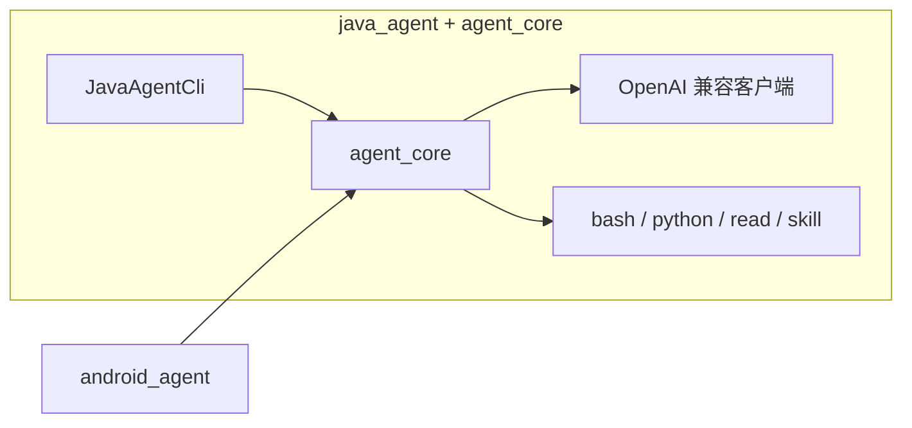

# Agent1

> 面向生产的 JVM Agent 工程：**Java CLI** + **可复用核心库**，并附带 **Android** 集成示例。

[](LICENSE)
[](https://www.alibabacloud.com/help/en/model-studio/compatibility-of-openai-with-dashscope)

## 项目目标

提供支持对话、工具调用、流式输出、可观测日志与基础成本控制的 Agent 参考实现，默认可对接阿里云 DashScope（OpenAI 兼容模式）等端点；核心库可在服务端 CLI 与 Android 等 JVM 场景中复用。

## 核心模块

| 模块 | 是什么 | 典型用途 |
|------|--------|----------|
| **`agent_core`** | JVM **Agent 核心库**（Java 17）：运行时、OpenAI 兼容流式 LLM、工具循环、事件流、ASR 等；**不是**独立 CLI。 | 被 `java_agent` 引用为 `:core`；可发布为 `com.agent1:java-agent-core` 供 Android 等依赖。 |
| **`java_agent`** | **Java 命令行与 Gradle 编排**：`cli` 提供单次/交互、流式/非流式、JSONL 日志等。 | 本地跑 CLI、打 fat-jar、测试与发布 core。见 [java_agent/README.md](java_agent/README.md)。 |
| **`android_agent`** | 可选 **Demo 应用**：依赖 `java-agent-core`，演示动态 UI、语音宠物等。 | 见 [android_agent/QUICKSTART.md](android_agent/QUICKSTART.md)。 |

## 当前功能（Java CLI + core）

- **对话**：单次 / 交互；流式 / 非流式
- **模型**：OpenAI 兼容 API（DashScope / Qwen 等）
- **工具**：`read_file`、`run_bash`、`run_python`、**Skill**（`.claude/skills` / `/skill`）
- **约束**：上下文条数、轮次与工具调用上限等（见 Java README）
- **可观测**：终端状态 + JSONL（`logs/agent1.jsonl`）

## 快速开始

### Java CLI

1. **JDK 17** + `DASHSCOPE_API_KEY` 或 `OPENAI_API_KEY`
2. 仓库根：

```bash
./run-java-agent-gradle 列出当前目录文件
# 非流式：./run-java-agent-gradle --no-stream 你好
```

详见 [java_agent/README.md](java_agent/README.md)。

### 发布 core / Android

```bash
./publish-java-agent-core.sh          # 本地 Maven，供 android_agent 使用
./build-android-agent.sh              # 编译安装 Demo（需 adb）
```

GitHub Actions 可下载 **不含 API Key** 的 Debug APK：见 [android_agent/QUICKSTART.md](android_agent/QUICKSTART.md)「从 GitHub Actions 下载」。

### 测试

```bash
gradle -p java_agent :core:test :cli:test
```

## 环境变量（摘要）

| Variable | Description |
|---|---|
| `DASHSCOPE_API_KEY` / `OPENAI_API_KEY` | 模型 API Key |
| `DASHSCOPE_BASE_URL` / `OPENAI_BASE_URL` | API 基地址 |
| `AGENT1_LOG_FILE` | JSONL 日志路径 |
| `AGENT1_MAX_CONTEXT_MESSAGES` | 上下文条数上限（Java CLI） |

完整列表见 [java_agent/README.md](java_agent/README.md)。

## 架构示意



## 仓库目录结构

```text
<repo>/
├── agent_core/                 # Java Agent 核心库
├── java_agent/                 # Java CLI + Gradle
├── android_agent/              # Android Demo
├── run-java-agent
├── run-java-agent-gradle
├── publish-java-agent-core.sh
├── build-android-agent.sh
├── .github/workflows/          # CI：Java 单测 + Android Debug APK 产物
├── CHANGELOG.md
├── CONTRIBUTING.md
└── LICENSE
```

## Contributing

见 [CONTRIBUTING.md](CONTRIBUTING.md)。

## License

MIT License. See [LICENSE](LICENSE).
