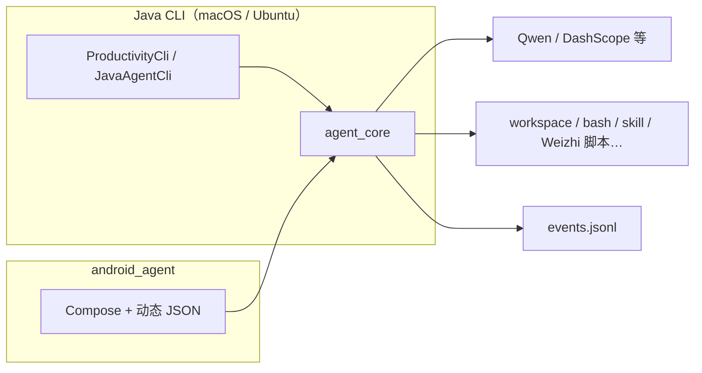

<p align="center">
  
</p>

<h1 align="center">Agent1</h1>

<p align="center">
  <strong>一套 JVM 内核，桌面与手机同一套智能体。</strong><br />
  <em>One JVM core. Same agent on desktop and phone.</em>
</p>

<p align="center">
  面向生产的智能体参考实现：持久会话、工作区沙箱、工具循环、结构化 JSONL 审计。<br />
  Java CLI（macOS / Ubuntu）与 Android 宿主共用 <code>agent_core</code>，UI 与配色对齐姊妹项目
  <a href="https://github.com/fengshihao/molan">墨览 molan</a>（暖纸 / 墨夜 / 琥珀强调）。
</p>

<p align="center">
  <a href="#zh">中文</a> ·
  <a href="#en">English</a> ·
  <a href="CONTRIBUTING.md">贡献</a> ·
  <a href="AGENTS.md">AGENTS（给 AI）</a> ·
  <a href="docs/ai/START.md">一句话开工</a>
</p>

<p align="center">
  
  
  
</p>

---

<a id="zh"></a>

## 为什么做 Agent1

| | |
| --- | --- |
| **可嵌入，而非绑死 UI** | 核心制品是 `java-agent-core`：ReAct、会话、工作区、事件落盘；宿主只接 LLM 与（可选）界面 |
| **生产力路径优先** | `--productivity`：Session、`events.jsonl`、workspace 工具；经典 CLI 保留 bash / python / skill |
| **可审计** | 模型请求、工具调用、用量写入 JSONL，便于回放、排障与后续「自进化」规划 |
| **双端一致** | 桌面 `ProductivityCli` 与 Android `ProductivityAgentGateway` 同一演进方向 |
| **面向 AI 贡献** | 复制 [docs/ai/START.md](docs/ai/START.md) 里的一句提示，让 Cursor / Claude Code / 其他编码智能体自行克隆、读契约、跑检查 |

> **Python CLI 已归档。** 历史代码只读见 [`archive/python-agent`](https://github.com/fengshihao/agent1/tree/archive/python-agent)；新功能请在 Java / Android 路径开发。

### 功能愿景（我们在往哪走）

1. **编程型智能体**：模型在 workspace 内写 JS orchestrator（Weizhi `execute_script`），通过 Caps / catalog 调用能力，而不是把全部工具塞进系统提示。
2. **可嵌入 SDK**：三方集成面收敛到 `ProductivityAgentHost` + `LlmClient` +（可选）脚本引擎与扩展工具（详见 [doc/规划/Agent1-SDK愿景.md](doc/规划/Agent1-SDK愿景.md)）。
3. **自进化与公共层**：Session 沙箱隔离；可复用产出经晋升 API 进入 `shared/`；能力检索代替提示词灌包（详见 [doc/规划/自进化Agent/README.md](doc/规划/自进化Agent/README.md)）。
4. **与墨览同气质**：Android 生产力对话主题对齐 molan 纸本配色，降低「工具感」、拉长阅读与对话舒适度。

### 当前已落地（摘要）

| 模块 | 说明 |
|------|------|
| **`agent_core`** | 运行时、OpenAI 兼容流式 LLM、工具循环、会话 / 工作区 / JSONL |
| **`java_agent`** | Gradle + `JavaAgentCli` / `ProductivityCli`、fat-jar、单测 |
| **`android_agent`** | Compose 动态 JSON UI、Qwen 生成界面、接 core 的多轮对话 Demo |

生产力路径能力：`read_file` / `write_file` / `edit_file` / `list_dir`、`read_url`、`chat_history`、轮次裁剪、`FileSessionStore` 等。经典路径：`RunBashTool`、`RunPythonTool`、`SkillTool` 等。

---

## 快速开始

### 环境

```bash
export DASHSCOPE_API_KEY="your-key"   # 或 ALIBABA_API_KEY / OPENAI_API_KEY / QWEN_API_KEY
```

### 运行

```bash
./agent1                  # 生产力助手 · 交互
./agent1 你好             # 单次提问
./agent1 models           # 模型与运行时参数
./agent1 logs failed      # 查事件日志

./run-java-agent "列出当前目录文件"           # 经典 CLI
./run-java-agent-gradle "列出当前目录文件"    # 跳过 fat-jar，直接 Gradle
```

Android 与 core 发布：

```bash
./publish-java-agent-core.sh
./build-android-agent.sh    # 需 adb，见 android_agent/QUICKSTART.md
```

### 检查（与 CI 同源，PR 前必跑）

```bash
gradle -p java_agent :core:test :cli:test   # Java 单元测试（必须有对应用例）
./scripts/ci-local.sh fast                    # 日常：Java 静态 + java-test
./scripts/ci-local.sh full                    # 含 Android assemble（需 ANDROID_HOME）
./check-agent1-quality.sh                     # Java PMD/SpotBugs + Android 分层门禁
./scripts/cloud-agent-verify.sh               # 无 Gradle 的轻量校验（Cloud Agent）
```

GitHub Actions：[`.github/workflows/ci.yml`](.github/workflows/ci.yml) — `java-test`、`quality-static`、`android-assemble-debug`。推送或更新 PR 后 **须全部通过**。

---

## 用其他 AI 智能体一句话集成

**给人看的两步：**

1. 把 [docs/ai/START.md](docs/ai/START.md) 里的「准备环境」整段复制给 Cursor、Claude Code、Codex 等。
2. 环境就绪后，用同文件里的「贡献一句」说明你要改什么；要求智能体按 [AGENTS.md](AGENTS.md) 与 [docs/ai/CHECKLIST.md](docs/ai/CHECKLIST.md) 改代码，并在开 PR 前跑通检查。

**机器契约（优先于聊天口头约定）：** [AGENTS.md](AGENTS.md) · [docs/ai/PR_PLAYBOOK.md](docs/ai/PR_PLAYBOOK.md)

---

## 仓库结构

```text
agent1/
├── agent_core/              # JVM 核心库（发布 com.agent1:java-agent-core）
├── java_agent/              # CLI + Gradle
├── android_agent/           # Android Demo（图标与主题见 app/src/main/res）
├── doc/                     # 规划、集成、Cloud Agent 约定
├── docs/ai/                 # 给编码智能体的开工与清单
├── scripts/ci-local.sh      # 本地对齐 CI
├── agent1                   # 生产力 CLI 入口
└── AGENTS.md                # 机器契约
```


```mermaid
flowchart LR
  subgraph Desktop["Java CLI（macOS / Ubuntu）"]
    CLI[ProductivityCli / JavaAgentCli]
    CLI --> Core[agent_core]
  end
  subgraph Mobile["android_agent"]
    App[Compose + 动态 JSON]
    App --> Core
  end
  Core --> LLM[Qwen / DashScope 等]
  Core --> Tools[workspace / bash / skill / Weizhi 脚本…]
  Core --> Events[events.jsonl]
```

---

## 环境变量（摘要）

| 变量 | 说明 |
|------|------|
| `DASHSCOPE_API_KEY` / `ALIBABA_API_KEY` / `OPENAI_API_KEY` | 模型 API Key |
| `ALIBABA_BASE_URL` / `OPENAI_BASE_URL` | OpenAI 兼容基地址 |
| `AGENT1_AGENT_ROOT` | 会话与日志数据根（生产力路径） |
| `AGENT1_MAX_CONTEXT_TURNS` 等 | 见 `AgentRuntimeDefaults` |

经典 CLI 另有 `AGENT1_MAX_CONTEXT_MESSAGES`、`AGENT1_LOG_FILE` 等，见 [java_agent/README.md](java_agent/README.md)。

---

## 贡献与质量门禁

- 人类贡献：[CONTRIBUTING.md](CONTRIBUTING.md)
- **新增或修改行为须附带自动化测试**（`:core:test` / `:cli:test`，Android 改 UI 或解析层时补 `src/test`）
- **PR 前** `./scripts/ci-local.sh fast`（动 Android 构建链则 `full`）
- Android 分层与包路径：遵守 [`.cursor/rules/android-layering.mdc`](.cursor/rules/android-layering.mdc)

## License

[MIT](LICENSE)

---

<a id="en"></a>

## English

### Why Agent1

Agent1 is a **production-oriented JVM agent stack**: one shared **`agent_core`** for **Java CLI** on macOS/Ubuntu and **Android** hosts. It emphasizes durable sessions, sandboxed workspace tools, a tool-calling loop, and **JSONL audit logs**—not a monolithic chat app you cannot embed.

**Vision (direction of travel):**

- Embeddable **programming agent** runtime (`ProductivityAgentHost`, published as `java-agent-core`)
- Workspace-first tools and optional Weizhi JS orchestration instead of huge static tool lists in the system prompt
- Longer-term **self-evolving** agent data model (session isolation, promotion to shared catalog)—see `doc/规划/`
- Android productivity UI theming aligned with **[molan](https://github.com/fengshihao/molan)** (warm paper, ink night, amber accent)

**Python CLI is archived** on branch `archive/python-agent`; do not extend it on `master`.

### Quick start

```bash
export DASHSCOPE_API_KEY="your-key"
./agent1 "hello"
gradle -p java_agent :core:test :cli:test
./scripts/ci-local.sh fast
```

### Integrate another coding agent in one message

Copy the **environment bootstrap** block from [docs/ai/START.md](docs/ai/START.md) into Cursor, Claude Code, or any agent that can run shell commands. Then send the **contribution one-liner** from the same file. Machine contract: [AGENTS.md](AGENTS.md).

### Quality gates (required before PR)

| Check | Purpose |
|-------|---------|
| `gradle -p java_agent :core:test :cli:test` | Unit tests for changed Java behavior |
| `./scripts/ci-local.sh fast` | Matches CI `java-test` + static subset |
| `./check-agent1-quality.sh` | PMD, SpotBugs, Android layering |
| GitHub Actions `ci.yml` | Must be green on the PR |

New features **must** include automated tests where the repo already tests similar code; UI-only changes should add or update `android_agent` unit tests when touching parsers or view models.

### Modules

| Module | Role |
|--------|------|
| `agent_core` | Shared runtime library |
| `java_agent` | CLI and Gradle build |
| `android_agent` | Compose demo; **app icon** under `app/src/main/res/drawable/` (README uses the same artwork via `docs/assets/app-icon.svg`) |

Further reading: [java_agent/README.md](java_agent/README.md), [android_agent/README.md](android_agent/README.md), [doc/cloud-agent.md](doc/cloud-agent.md).
