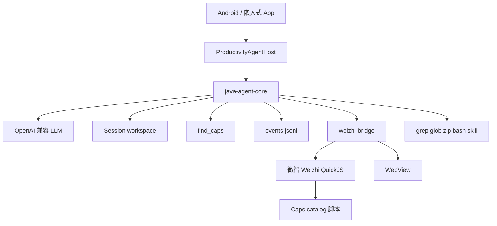

<p align="center">
  
</p>

<h1 align="center">Agent1</h1>

<p align="center">
  <strong>给 Android 与嵌入式宿主用的轻量编程智能体 · 生产力助手。</strong><br />
  <em>A compact programming agent for Android and embedded JVM hosts.</em>
</p>

<p align="center">
  可嵌入的 <code>java-agent-core</code>：会话、工作区沙箱、工具循环与 JSONL 审计。<br />
  核心运行时约 <strong>3MB</strong> 量级，适合装进 App、车机、工控平板等资源受限设备，帮用户<strong>处理各类办公与自动化工作</strong>。
</p>

<p align="center">
  <a href="#zh">中文</a> ·
  <a href="#en">English</a> ·
  <a href="CONTRIBUTING.md">贡献</a> ·
  <a href="AGENTS.md">AGENTS（给 AI）</a> ·
  <a href="docs/ai/START.md">一句话开工</a>
</p>

<p align="center">
  
  
  
</p>

---

<a id="zh"></a>

## 为什么做 Agent1

| | |
| --- | --- |
| **为嵌入而生** | 不是「只能在我们 App 里聊」的黑盒聊天；宿主接入 `ProductivityAgentHost` + LLM 即可拥有完整生产力循环 |
| **极小内核** | `java-agent-core` 专注 ReAct、Session、workspace、事件落盘；整体约 **3MB** 量级，便于与业务 APK 同包分发 |
| **编程型助手** | 主路径是写 **JavaScript**（QuickJS / `run_js`）编排任务，而不是把几十种工具名塞进系统提示 |
| **能干活** | 读写工作区、检索历史、拉网页、跑脚本、调 WebView、接 MCP、加载 Skill；面向真实文档/表格/流程类工作 |
| **可进化** | Skill 沉淀、`find_caps` 按需发现能力、晋升到公共 catalog；Session 沙箱 + 审计日志支撑长期演进 |
| **双端验证** | Android 是首要宿主；macOS / Ubuntu 上的 `./agent1` 用于联调、CI 与无屏环境 |

桌面 **生产力 CLI**（`./agent1`）与 **Android 生产力 App** 共用同一内核，能力对照见 [doc/CLI与Android-Agent能力对照.md](doc/CLI与Android-Agent能力对照.md)。

---

## 产品愿景：嵌入式里的「会写脚本的同事」

Agent1 要成为 **Android / 嵌入式 JVM 宿主** 里的默认 **生产力编程智能体**：

1. **用户说人话，助手写 JS**  
   在 Session `workspace/` 里用一段脚本编排任务（`run_js`），通过 Weizhi QuickJS 调用 `fs`、平台 **Caps**、catalog 脚本、以及白名单内的 `$tools` 桥。多步工作写在同一段脚本里，而不是一轮轮硬调零散 Java Tool。

2. **工具少而精，细节靠检索**  
   Java 层只保留工作区 I/O、脚本执行、用户澄清等「内核工具」。具体怎么做 Word、分享、画图、调外部服务，先走 **`find_caps`**：结果里的调用示例可以直接写进脚本。Skill 命中时附上正文。API 手册不打进 APK。

3. **Skill：可加载、可自创、可晋升**  
   - **加载**：`load_skill` 从 workspace `skills/`、App `assets`（Android）或项目目录（桌面联编）拉取 SKILL.md 工作流。  
   - **自创**：运行中在 workspace 沉淀可重复流程，经总结与 **`promote_request`**（及后续审查 API）进入 `shared/local/skills/`，供后续 Session 复用（自进化路线见 [doc/规划/自进化Agent/README.md](doc/规划/自进化Agent/README.md)）。

4. **MCP：外接能力而不膨胀内核**  
   通过 `agentRoot/mcp_servers.json` 配置 MCP Server；索引进入 `find_caps`（kind=mcp），脚本内用 **`$mcp.<server>.<tool>`** 调用，不把每个 MCP 工具都注册成 Java `@Tool`。

5. **WebView：在设备上「看得见」的结果**  
   - **Android**：系统 WebView + `webview_exec`，适合渲染脚本页、图表、表单总结等（见 `android_agent/doc/webview-draw-e2e.md`）。  
   - **桌面联调**：Headless Chromium + CDP，协议与 Skill 尽量与 Android 对齐。

6. **自进化数据面**  
   Session 隔离的可写沙箱；可复用产出晋升到 **shared/**；`events.jsonl` 全链路审计；catalog 与云端资源同步（规划中）。目标：越用越懂你的流程，而不是每次从零科普工具列表。

更完整的 SDK 集成面见 [doc/规划/Agent1-SDK愿景.md](doc/规划/Agent1-SDK愿景.md)。

---

## 依赖：微智 Weizhi（之谓）

Agent1 的脚本、设备能力和 WebView 依赖独立开源项目 **[Weizhi / 之谓（常称微智）](https://github.com/fengshihao/weizhi)**：嵌入式 **QuickJS**、沙箱 `fs`、可选 **Caps**（Android 文件、分享、提醒等），以及脚本内的 `mcp.connect`。

给模型调用的 `grep` / `glob` / `zip` / `bash` / `load_skill_through_path` 在 **`java-agent-core`** 里用 `@Tool` 实现，桌面和 Android 共用。集成 Weizhi 时才注册。`webview_exec` 仍按平台分别实现（Android 系统 WebView、桌面 CDP），脚本引擎仍是 Weizhi。

| | **Agent1（`java-agent-core`）** | **Weizhi** |
| --- | --- | --- |
| **定位** | 生产力 **编排层**：ReAct、Session、模型可见的 Java 工具、能力检索、JSONL 审计 | **脚本引擎**：在设备里跑 QuickJS |
| **LLM 可见** | 工作区读写、`grep` / `glob` / `zip` / `bash`、`load_skill_through_path`、`run_js`、`webview_exec` | 脚本内 `fs`、`$tools`、`$mcp`、Caps。这些不是单独的模型工具 |
| **集成方式** | 发布 `java-agent-core` | 源码联编或 Maven AAR；经 `weizhi-bridge` 与 Android `WeizhiHostLoader` 接入 |

**典型分工**：用户描述任务 → Agent1 用 Java 工具改文件、搜索、跑白名单命令、加载 Skill → 需要编排时用 **`run_js`** 交给 Weizhi → 脚本里调 `fs`、Caps、MCP，或 `webview_exec` 出图 → 事件写回 `events.jsonl`。

### 在本仓库里怎么带上 Weizhi

```bash
./sync-weizhi.sh          # 默认 fengshihao/weizhi → ./weizhi；fork 可设 WEIZHI_GIT_URL
cd android_agent && ./gradlew :app:assembleDebug   # CI 同样先 sync 再 assemble
```

- **无 weizhi 时**：仍可使用工作区读写、`read_url`、`chat_history` 等 **内核工具**（适合极简集成或先接 UI）。
- **有 weizhi 时**：打开脚本、MCP、WebView，并注册 `agent_core` 里的 grep / glob / zip / bash / skill。App 内 `BuildConfig.WEIZHI_INTEGRATED=true`。
- **无 NDK / 无源码**：可用 [`android_agent/weizhi-prebuilt`](android_agent/weizhi-prebuilt/README.md) 导入预编译 Maven（见 QUICKSTART）。

Weizhi 自身文档：[README](https://github.com/fengshihao/weizhi) · [AI 集成指南](https://github.com/fengshihao/weizhi/blob/master/docs/INTEGRATION_FOR_AI.md) · Agent1 侧说明：[doc/集成/WEIZHI.md](doc/集成/WEIZHI.md)。

---

## 能力地图（摘要）

### 内核工具（不依赖 Weizhi 亦有）

`read_file` · `write_file` · `edit_file` · `list_dir` · `read_url` · `chat_history` · `read_agent_doc` · catalog / promote 相关占位与自进化只读工具等。

### 集成 Weizhi 后的扩展环

| 类别 | 说明 |
|------|------|
| **JS / 脚本** | `run_js`、QuickJS、`$tools` / `$mcp` 桥、workspace 内多文件工程 |
| **检索** | `find_caps` — 按关键词查 Skill、文档、MCP 工具摘要等 |
| **Skill** | `load_skill` + workspace / assets 下的 SKILL.md |
| **MCP** | `mcp_servers.json` + 脚本内 MCP 调用 |
| **WebView** | `webview_exec`（Android WebView / 桌面 Chromium） |
| **工作区增强** | `grep` · `glob` · `zip` · 白名单 `bash`。实现在 `agent_core`，集成 Weizhi 时注册 |

Android 启用完整环：联编 `weizhi` 或使用 `weizhi-prebuilt`，见 [android_agent/QUICKSTART.md](android_agent/QUICKSTART.md)。

---

## 快速开始

### 环境

```bash
export DASHSCOPE_API_KEY="your-key"   # 或 ALIBABA_API_KEY / OPENAI_API_KEY / QWEN_API_KEY
```

### Android（推荐路径）

```bash
./publish-java-agent-core.sh      # 发布 java-agent-core 到本地 Maven
./build-android-agent.sh          # Debug，需 adb（Release：--release）
```

在 App 内使用 **生产力助手** Tab：`ProductivityAgentHost` + 会话列表 / 流式聊天 / 模型设置（参考 `android_agent` 分层架构）。

### 桌面联调（macOS / Ubuntu）

```bash
./agent1                  # 生产力助手 · 交互
./agent1 你好             # 单次提问
./agent1 models           # 模型与运行时参数
./agent1 tools            # 当前平台工具能力摘要
./agent1 logs failed      # 查 events.jsonl
```

### 检查（与 CI 同源，PR 前必跑）

```bash
gradle -p java_agent :core:test :cli:test
./scripts/ci-local.sh fast
./scripts/ci-local.sh full          # 含 Android assemble（需 ANDROID_HOME）
./check-agent1-quality.sh
```

GitHub Actions：[`.github/workflows/ci.yml`](.github/workflows/ci.yml) — `java-test`、`quality-static`、`android-assemble-debug`。

---

## 用其他 AI 智能体一句话集成

1. 复制 [docs/ai/START.md](docs/ai/START.md) 的「准备环境」给 Cursor、Claude Code 等。
2. 再用同文件的「贡献一句」说明改动范围；要求按 [AGENTS.md](AGENTS.md) 与 [docs/ai/CHECKLIST.md](docs/ai/CHECKLIST.md) 完成单测与 `ci-local.sh`。

---

## 仓库结构

```text
agent1/
├── agent_core/              # java-agent-core（~3MB 量级运行时）
├── java_agent/              # CLI + Gradle + weizhi-bridge
├── android_agent/           # 嵌入式宿主参考 App（Compose + 生产力助手）
├── doc/                     # 能力对照、集成、规划
├── docs/ai/                 # 编码智能体开工文档
└── AGENTS.md
```


```mermaid
flowchart TB
  Host[Android / 嵌入式 App]
  Host --> Gateway[ProductivityAgentHost]
  Gateway --> Core[java-agent-core]
  Core --> LLM[OpenAI 兼容 LLM]
  Core --> WS[Session workspace]
  Core --> Search[find_caps]
  Core --> Audit[events.jsonl]
  Core --> Bridge[weizhi-bridge]
  Bridge --> WZ[微智 Weizhi QuickJS]
  Core --> JavaTools[grep glob zip bash skill]
  WZ --> Cap[Caps catalog 脚本]
  Bridge --> WV[WebView]
```

---

## 环境变量（摘要）

| 变量 | 说明 |
|------|------|
| `DASHSCOPE_API_KEY` / `ALIBABA_API_KEY` / `OPENAI_API_KEY` | 模型 API Key |
| `ALIBABA_BASE_URL` / `OPENAI_BASE_URL` | OpenAI 兼容基地址 |
| `AGENT1_AGENT_ROOT` | 会话与日志数据根（桌面生产力路径） |
| `AGENT1_SCRIPT_TIMEOUT_MS` 等 | 脚本与运行时限额，见 `AgentRuntimeDefaults` |

运行时数据目录：[桌面生产力](java_agent/doc/runtime-data-layout.md) · [Android App](android_agent/doc/runtime-data-layout.md)。能力差异见 [CLI 与 Android 对照](doc/CLI与Android-Agent能力对照.md)。

---

## 贡献与质量门禁

- [CONTRIBUTING.md](CONTRIBUTING.md) · [AGENTS.md](AGENTS.md)
- 行为变更须 **JUnit / Android 单测** + `./scripts/ci-local.sh fast`
- Android 分层：[`.cursor/rules/android-layering.mdc`](.cursor/rules/android-layering.mdc)

## License

[MIT](LICENSE)

---

<a id="en"></a>

## English

### What Agent1 is

Agent1 is a **compact, embeddable programming agent** for **Android and other JVM hosts**: ship ~**3MB**-class `java-agent-core`, wire your LLM, and get sessions, sandboxed workspaces, tool loops, and JSONL audit logs—a **productivity assistant** that can handle real work (files, scripts, web, MCP, skills), not just chat.

### Weizhi (微智) dependency

**Weizhi** supplies the on-device QuickJS engine, sandbox `fs`, Caps, and the in-script MCP client. **Agent1** owns the model-facing tools (`grep`, `glob`, `zip`, `bash`, `load_skill_through_path`) in `java-agent-core`, plus sessions, capability search, and JSONL audit. `webview_exec` stays platform-specific and is registered when Weizhi is integrated. Details: [doc/集成/WEIZHI.md](doc/集成/WEIZHI.md).

### How it works

- **JavaScript-first**: orchestrate tasks with `run_js` (Weizhi QuickJS) in the session workspace; call Caps, catalog scripts, `$tools`, and `$mcp.*` from JS.
- **Discovery, not prompt bloat**: use **`find_caps`** to get a callable example for skills, APIs, and MCP tools; load workflows with **`load_skill`**. API manuals are not shipped in the app.
- **WebView tools**: render script-driven pages on device (Android WebView; desktop Chromium for dev).
- **MCP**: configure servers under `agentRoot`; invoke from scripts without registering every tool in Java.
- **Self-evolution**: session sandboxes, promotion to shared catalog, full event trail—see `doc/规划/自进化Agent/`.

### Quick start

```bash
export DASHSCOPE_API_KEY="your-key"
./publish-java-agent-core.sh && ./build-android-agent.sh
./agent1 "hello"    # desktop productivity CLI for dev/CI
gradle -p java_agent :core:test :cli:test
./scripts/ci-local.sh fast
```

### One-liner for other coding agents

See [docs/ai/START.md](docs/ai/START.md) and [AGENTS.md](AGENTS.md).

Further reading: [doc/CLI与Android-Agent能力对照.md](doc/CLI与Android-Agent能力对照.md), [android_agent/README.md](android_agent/README.md), [doc/cloud-agent.md](doc/cloud-agent.md).
