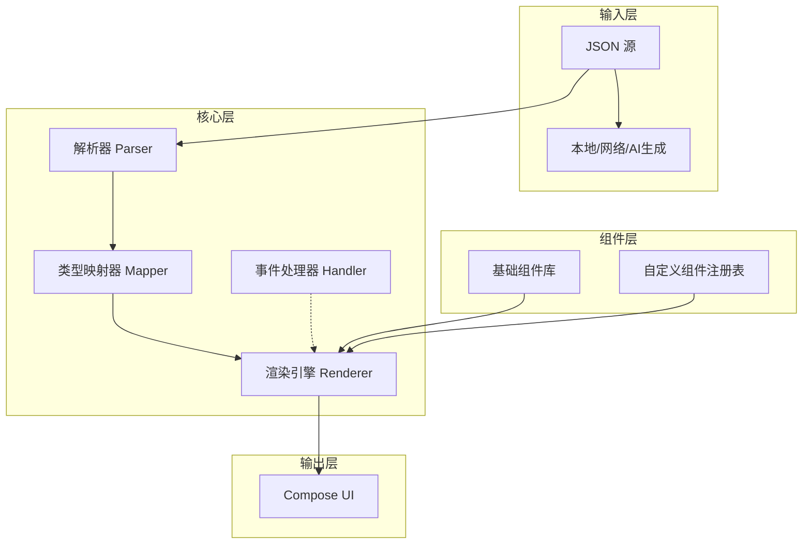

# 动态JSON渲染引擎 for Jetpack Compose
## 设计方案文档

## v1 当前实现（已落地）

第一版已在 `android` 目录提供最小可运行工程，范围如下：

- 仅 Android 本地资源 JSON 渲染（不依赖 AI 生成）
- 支持组件：`text` `button` `column` `row` `image`
- 支持样式：`padding` `backgroundColor` `textColor` `fontSize` `fontWeight`
- 支持事件：`navigate(route, params)`
- 提供样例 JSON 与解析单元测试

如需快速上手，请先看 `android/README.md`。

## 📋 项目概述

### 目标
创建一个轻量级、可扩展的库，将 **JSON 动态转换为 Jetpack Compose UI**，支持从服务器/AI 实时下发界面描述，实现 BDUI（后端驱动 UI）架构。

### 核心能力
- **运行时解析**：JSON → Compose UI 的实时转换
- **组件化**：支持基础组件（Text、Button、Column等）和自定义组件
- **事件系统**：JSON 定义交互行为
- **样式系统**：动态样式配置
- **数据绑定**：支持动态数据注入和更新

## 🏗️ 架构设计

### 分层架构



### 模块划分

```
com.dynamicui/
├── core/                 # 核心模块
│   ├── parser/          # JSON 解析
│   ├── model/           # UI 数据模型
│   └── engine/          # 渲染引擎
├── components/           # 组件库
│   ├── basic/           # 基础组件
│   └── layout/          # 布局组件
├── action/              # 事件系统
│   ├── handler/         # 事件处理器
│   └── navigation/      # 导航
├── style/               # 样式系统
│   ├── theme/           # 主题
│   └── modifier/        # 修饰符
└── extensions/          # 扩展点
    ├── custom/          # 自定义组件
    └── plugin/          # 插件系统
```

## 📝 数据模型设计

### UI 模型基类
```kotlin
// 核心模型
sealed class UIComponent {
    abstract val type: String
    abstract val key: String?
    abstract val style: UIStyle?
    abstract val action: UIAction?
}

// 基础组件
data class UIText(
    val content: String,
    override val style: UIStyle? = null,
    override val action: UIAction? = null,
    override val key: String? = null
) : UIComponent() {
    override val type = "text"
}

// 布局组件
data class UIColumn(
    val children: List<UIComponent>,
    val horizontalAlignment: String? = null,
    override val style: UIStyle? = null,
    override val key: String? = null
) : UIComponent() {
    override val type = "column"
}

// 交互组件
data class UIButton(
    val text: String,
    override val action: UIAction,
    override val style: UIStyle? = null,
    override val key: String? = null
) : UIComponent() {
    override val type = "button"
}
```

### 样式模型
```kotlin
data class UIStyle(
    // 尺寸
    val width: Dp? = null,
    val height: Dp? = null,
    val padding: PaddingValues? = null,
    
    // 颜色
    val backgroundColor: Color? = null,
    val textColor: Color? = null,
    
    // 字体
    val fontSize: TextUnit? = null,
    val fontWeight: FontWeight? = null,
    val fontFamily: String? = null,
    
    // 边框
    val border: BorderStroke? = null,
    val borderRadius: Dp? = null,
    
    // 阴影
    val elevation: Dp? = null
)
```

### 事件模型
```kotlin
sealed class UIAction {
    data class Navigate(
        val route: String,
        val params: Map<String, Any>? = null
    ) : UIAction()
    
    data class ApiCall(
        val url: String,
        val method: String = "GET",
        val body: Map<String, Any>? = null
    ) : UIAction()
    
    data class ShowDialog(
        val title: String,
        val message: String
    ) : UIAction()
    
    data class Custom(
        val type: String,
        val data: Map<String, Any>
    ) : UIAction()
}
```

## 🎨 JSON Schema 设计

### 基础格式
```json
{
  "$schema": "http://json-schema.org/draft-07/schema#",
  "type": "object",
  "properties": {
    "version": { "type": "string" },
    "root": { "$ref": "#/definitions/component" }
  },
  "definitions": {
    "component": {
      "type": "object",
      "required": ["type"],
      "properties": {
        "type": { "type": "string" },
        "key": { "type": "string" },
        "style": { "$ref": "#/definitions/style" },
        "action": { "$ref": "#/definitions/action" }
      }
    }
  }
}
```

### 使用示例
```json
{
  "version": "1.0",
  "root": {
    "type": "column",
    "style": {
      "padding": 16,
      "backgroundColor": "#FFFFFF"
    },
    "children": [
      {
        "type": "text",
        "content": "欢迎使用动态UI",
        "style": {
          "fontSize": 24,
          "fontWeight": "bold",
          "textColor": "#333333"
        }
      },
      {
        "type": "button",
        "text": "点击获取数据",
        "style": {
          "backgroundColor": "#2196F3",
          "textColor": "#FFFFFF",
          "borderRadius": 8,
          "padding": 12
        },
        "action": {
          "type": "api_call",
          "url": "https://api.example.com/data",
          "method": "GET",
          "onSuccess": {
            "type": "navigate",
            "route": "detail",
            "params": {
              "data": "{response.data}"
            }
          }
        }
      }
    ]
  }
}
```

## 🔧 核心实现

### 渲染引擎
```kotlin
@Composable
fun DynamicUI(
    json: String,
    modifier: Modifier = Modifier,
    actionHandler: ActionHandler = DefaultActionHandler,
    customComponents: Map<String, @Composable (UIComponent) -> Unit> = emptyMap()
) {
    val uiModel = remember(json) { parseJson(json) }
    
    CompositionLocalProvider(
        LocalActionHandler provides actionHandler,
        LocalCustomComponents provides customComponents
    ) {
        RenderComponent(uiModel.root, modifier)
    }
}

@Composable
private fun RenderComponent(
    component: UIComponent,
    modifier: Modifier = Modifier
) {
    when (component) {
        is UIText -> RenderText(component, modifier)
        is UIButton -> RenderButton(component, modifier)
        is UIColumn -> RenderColumn(component, modifier)
        is UIRow -> RenderRow(component, modifier)
        is UIImage -> RenderImage(component, modifier)
        else -> {
            // 检查自定义组件
            val customRenderer = LocalCustomComponents.current[component.type]
            if (customRenderer != null) {
                customRenderer(component)
            } else {
                Text("未知组件: ${component.type}")
            }
        }
    }
}
```

### 组件渲染实现
```kotlin
@Composable
private fun RenderText(
    component: UIText,
    modifier: Modifier = Modifier
) {
    val style = component.style?.toTextStyle() ?= LocalTextStyle.current
    
    Text(
        text = component.content,
        modifier = modifier.applyStyle(component.style),
        style = style,
        color = component.style?.textColor ?: Color.Unspecified,
        fontSize = component.style?.fontSize ?: TextUnit.Unspecified,
        fontWeight = component.style?.fontWeight
    )
}

@Composable
private fun RenderButton(
    component: UIButton,
    modifier: Modifier = Modifier
) {
    val actionHandler = LocalActionHandler.current
    
    Button(
        onClick = { actionHandler.handle(component.action) },
        modifier = modifier.applyStyle(component.style),
        shape = RoundedCornerShape(component.style?.borderRadius ?: 0.dp),
        colors = ButtonDefaults.buttonColors(
            backgroundColor = component.style?.backgroundColor ?: MaterialTheme.colors.primary
        )
    ) {
        Text(
            text = component.text,
            color = component.style?.textColor ?: Color.White
        )
    }
}
```

### 事件处理系统
```kotlin
interface ActionHandler {
    suspend fun handle(action: UIAction): ActionResult
}

class DefaultActionHandler(
    private val navController: NavHostController? = null,
    private val context: Context
) : ActionHandler {
    
    override suspend fun handle(action: UIAction): ActionResult {
        return when (action) {
            is UIAction.Navigate -> handleNavigate(action)
            is UIAction.ApiCall -> handleApiCall(action)
            is UIAction.ShowDialog -> handleShowDialog(action)
            is UIAction.Custom -> handleCustom(action)
        }
    }
    
    private suspend fun handleNavigate(action: UIAction.Navigate): ActionResult {
        navController?.navigate(action.route) {
            action.params?.forEach { (key, value) ->
                arguments?.putString(key, value.toString())
            }
        }
        return ActionResult.Success
    }
    
    private suspend fun handleApiCall(action: UIAction.ApiCall): ActionResult {
        return try {
            val response = makeApiRequest(action)
            // 处理响应，可能触发下一个动作
            handleActionChain(action.onSuccess, response)
            ActionResult.Success(response)
        } catch (e: Exception) {
            ActionResult.Error(e.message ?: "API调用失败")
        }
    }
}
```

### 样式应用
```kotlin
fun Modifier.applyStyle(style: UIStyle?): Modifier {
    if (style == null) return this
    
    return this
        .then(style.width?.let { width(it) } ?: this)
        .then(style.height?.let { height(it) } ?: this)
        .then(style.padding?.let { padding(it) } ?: this)
        .then(style.backgroundColor?.let { background(it) } ?: this)
        .then(style.border?.let { border(it) } ?: this)
        .then(style.elevation?.let { shadow(it) } ?: this)
}

fun UIStyle.toTextStyle(): TextStyle {
    return TextStyle(
        color = textColor ?: Color.Unspecified,
        fontSize = fontSize ?: TextUnit.Unspecified,
        fontWeight = fontWeight,
        fontFamily = fontFamily?.let { FontFamily(it) }
    )
}
```

## 🔌 扩展点设计

### 自定义组件注册
```kotlin
class ComponentRegistry {
    private val components = mutableMapOf<String, @Composable (UIComponent) -> Unit>()
    
    fun register(type: String, renderer: @Composable (UIComponent) -> Unit) {
        components[type] = renderer
    }
    
    fun get(type: String): (@Composable (UIComponent) -> Unit)? = components[type]
}

// 使用示例
val registry = ComponentRegistry().apply {
    register("custom_card") { component ->
        Card(
            modifier = Modifier.padding(8.dp),
            elevation = 4.dp
        ) {
            // 自定义渲染逻辑
        }
    }
}
```

### 插件系统
```kotlin
interface DynamicUIPlugin {
    val supportedTypes: List<String>
    fun parse(json: JsonObject): UIComponent?
    @Composable
    fun Render(component: UIComponent, modifier: Modifier)
}

// 插件示例：图表组件
class ChartPlugin : DynamicUIPlugin {
    override val supportedTypes = listOf("bar_chart", "pie_chart")
    
    override fun parse(json: JsonObject): UIComponent? {
        return when (json["type"].text) {
            "bar_chart" -> parseBarChart(json)
            "pie_chart" -> parsePieChart(json)
            else -> null
        }
    }
    
    @Composable
    override fun Render(component: UIComponent, modifier: Modifier) {
        // 渲染图表
    }
}
```

## 📊 性能优化

### 缓存策略
```kotlin
class RenderCache {
    private val cache = LruCache<String, UIComponent>(maxSize = 50)
    
    fun getOrParse(key: String, json: String, parser: (String) -> UIComponent): UIComponent {
        return cache.get(key) ?: parser(json).also { cache.put(key, it) }
    }
}
```

### 增量更新
```kotlin
@Composable
fun DynamicUIWithDiff(
    oldJson: String?,
    newJson: String,
    modifier: Modifier = Modifier
) {
    val oldModel = oldJson?.let { parseJson(it) }
    val newModel = parseJson(newJson)
    
    // 计算差异，只更新变化的部分
    val diff = computeDiff(oldModel, newModel)
    
    // 根据差异选择性重组
    RenderWithDiff(diff, modifier)
}
```

## 🚀 使用示例

### 基础用法
```kotlin
@Composable
fun MyScreen() {
    val json = remember {
        """
        {
            "type": "column",
            "children": [
                {
                    "type": "text",
                    "content": "Hello Dynamic UI",
                    "style": { "fontSize": 20 }
                }
            ]
        }
        """.trimIndent()
    }
    
    DynamicUI(
        json = json,
        actionHandler = MyActionHandler()
    )
}
```

### 与AI集成
```kotlin
@Composable
fun AIGeneratedScreen(prompt: String) {
    var uiJson by remember { mutableStateOf<String?>(null) }
    var isLoading by remember { mutableStateOf(false) }
    
    LaunchedEffect(prompt) {
        isLoading = true
        // 调用AI服务生成UI
        uiJson = aiService.generateUI(prompt)
        isLoading = false
    }
    
    when {
        isLoading -> CircularProgressIndicator()
        uiJson != null -> DynamicUI(json = uiJson!!)
        else -> Text("无法生成UI")
    }
}
```

## 📦 发布计划

### 版本规划
- **v0.1.0-alpha**: 基础组件 + JSON解析
- **v0.2.0-alpha**: 事件系统 + 样式系统
- **v0.3.0-beta**: 自定义组件 + 插件系统
- **v1.0.0**: 正式版 + 文档 + 示例

### 项目结构
```
dynamic-ui-compose/
├── library/              # 核心库
├── sample/               # 示例应用
├── compiler/             # 编译时处理（可选）
├── plugin/               # 官方插件
└── docs/                 # 文档
```

## ✅ 成功标准

1. **易用性**：3行代码完成JSON渲染
2. **扩展性**：5分钟内可添加自定义组件
3. **性能**：100个组件渲染 < 16ms
4. **文档**：完整的API文档和示例

---

这个设计方案可以作为Claude Code的实现基础。每个模块都有清晰的定义和边界，可以并行开发。需要我详细展开某个部分吗？