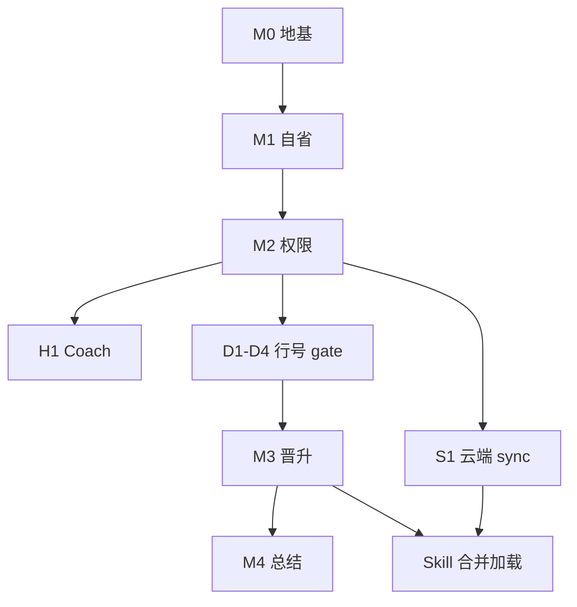

# 09 — 行动计划（讨论稿）

> 汇总 [01]–[08] 讨论结论，供对齐 **优先级** 与 **每阶段做到哪一步**。实现时以本表为迭代 backlog 来源；细节仍以分册为准。

## 北极星（一句话）

**Session 沙箱内干活 → 提示词/文档自知环境 → 区外仅 API（晋升 / 同步）→ 本地进化与云端 catalog 分层 → Rsync 式增量更新。**

---

## 工作流（五条线）

| 线 | 代号 | 交付物 | 依赖 |
|----|------|--------|------|
| **A. 地基** | `foundation` | 统一 `agentRoot`、目录.bootstrap、权限在工具层 enforce | 无 |
| **B. 自省** | `introspect` | 系统提示词摘要 v1、`docs/system/` 出厂包、只读读 shared/catalog | A |
| **C. 进化** | `evolve` | Promotion API、`shared/local/`、staging、audit 事件 | A、B |
| **D. 云端** | `catalog-sync` | manifest diff、`sync check/apply`、`shared/catalog/` | A |
| **E. 编排** | `orchestrate` | Session 总结、审查 API（初版 auto-approve）、Skill 加载合并 | B、C（D 可选并行） |
| **G. 可观测** | `coach` + `script-debug` | 运行时 Coach 钩子；QuickJS 错误 userLine 映射（[10][11]） | B；D1 宜早于大量 execute_script |

MCP、Android、rsync 块级传输属 **F. 扩展**，不挡第一验证闭环。

---

## 里程碑与「做到哪算完」

### M0 — 数据根与目录（建议 **最先做**）

| 项 | 做到哪 | 验收 |
|----|--------|------|
| 统一 `agentRoot` | `ProductivityCli` 与 `AgentDataPaths` **同一默认**；文档写清 env | 新装只有一个根；单测覆盖 |
| 首次启动 bootstrap | 创建 `sessions/`、`shared/catalog/`、`shared/local/`、`docs/system/`、`sync/`、`logs/` | 缺目录自动建 |
| `agent.manifest.json` v0 | 路径说明 + schema 版本 | 文件存在且可被测试读取 |

**不做**：Promotion、CDN、改 Skill 加载。

---

### D1–D4 — QuickJS 行号（**M3 门禁**，M2 之后做）

| 项 | 做到哪 | 验收 |
|----|--------|------|
| D1–D2 | prelude 映射 + 结构化错误 + snippet | 单测 + 集成测 |
| D3 | 优先 `file` 执行，报错 `foo.js:行号` | 行号 = 用户文件真实行 |
| D4 | **与 weizhi 协作**处理内建注入 | inline/file 多种错误 **零偏差** |

**未通过 D4 验收 → 不开 M3**（见 [11](./11-QuickJS调试与行号映射.md)）。

---

### H1 — Coach 钩子（**M2 同期**，方案 A）

| 项 | 做到哪 | 验收 |
|----|--------|------|
| 3～5 个高频钩子 | 越权路径、大文件写、inline 过长脚本等 | tool result 含 `[coach]` |
| `hookId` audit | 可选写 events | 可关 AGENT1_COACH |

详见 [10-运行时钩子与Coach提示.md](./10-运行时钩子与Coach提示.md)。

---

### M1 — 环境自知（提示词 + 只读文档）

| 项 | 做到哪 | 验收 |
|----|--------|------|
| 提示词环境摘要 v1 | 目录树、RW/只读/API 边界、职责、QuickJS 一句（[07]） | 新 Session 第一轮能答对「能否写 shared」 |
| 打包 `docs/system/*` | `directories.md`、`tools-and-quickjs.md`、`trusted-sources.md`（可先占位 URL） | 安装时拷入 agentRoot；工作 Agent **不能** write 改 system |
| 只读读区外 | 扩展 read：相对 workspace **或** 专用工具读 `docs/system`、列出 `shared/local`+`catalog` 索引（不递归读全库） | 能读 system README；write 仍拒绝区外 |

**不做**：Promotion 落盘、sync 下载。

---

### M2 — 工具层权限收紧

| 项 | 做到哪 | 验收 |
|----|--------|------|
| workspace 工具 | 维持仅 `workspace/**` 可 write | 现有测试 + 尝试写 `../shared` 失败 |
| 区外写入入口 | 无 `write_file` 到 shared；仅预留 API 接口（可先 stub 返回未实现） | 安全测试 |

**不做**：真实 Promotion 逻辑（可 M3 一起）。

---

### M3 — 晋升闭环（本地进化 **最小可用**）

| 项 | 做到哪 | 验收 |
|----|--------|------|
| `staging/` 约定 | Session workspace 下 `staging/skills/`、`staging/scripts/` | 文档 + 示例 |
| `promote_request` 工具 | 规则扫描（路径、大小、密钥 pattern）→ **审查侧恒 approve** → 写 `shared/local/` | 单测：staging skill → local 出现；events 有 audit |
| `docs/capabilities/` 更新 | Promotion 成功后 **代码**追加索引行（非工作 Agent 写） | 索引与 local 一致 |
| Skill 加载 v1 | 生产力路径加载 `shared/local/skills` + 仓库 `.claude/skills`（catalog 可 M4/S2 再加） | 晋升后的 skill 下一 Run 可被发现 |

**不做**：Session 自动总结 Agent、用户确认 UI、MCP。

---

### M4 — Session 总结（可选加深）

| 项 | 做到哪 | 验收 |
|----|--------|------|
| `/summarize` 或 quit 钩子 | 写 `session.summary.md` + 候选晋升列表（JSON 段） | 文件落盘 |
| 总结用 prompt | 第二路 LLM 或同模型；**仍不能**写区外，只写 summary 与 staging 建议 | 与 [03] 一致 |

**可砍**：第一版若时间紧，**M3 手动 promote + 用户口述** 即可验证进化。

---

### S1 — 云端 catalog（**Rsync 式**，可和 M3 **并行**）

| 项 | 做到哪 | 验收 |
|----|--------|------|
| 远程 `catalog-index.json` | 托管在 HTTPS CDN（可先 GitHub Release / 静态桶） | 手测 URL 可访问 |
| `agent1 sync check` | 拉 manifest，diff `sync/state.json`，输出 pending | CLI 集成测试（mock HTTP） |
| `agent1 sync apply` | 只下 pending；sha256；落盘 `shared/catalog/` | 单 skill zip 端到端 |
| 提示词 / 工具 | pending 数量进摘要或 `catalog_sync_status` | AI 能说出「有 N 个待更新」 |
| Skill 加载 | catalog + local 合并（local 覆盖同名） | 同步后 skill 可用 |

**不做**：rsync 二进制、签名 manifest、定时 daemon（可 `check` 仅手动）。

---

### M5+ — 扩展（后排）

| 里程碑 | 内容 | 建议时机 |
|--------|------|----------|
| M5 | MCP 清单、`shared/mcp/`、自省 | 有明确 MCP 宿主需求 |
| M6 | 定时 sync check、trusted-sources 多源 | S1 稳定后 |
| M7 | manifest 签名、librsync/rsync 大包 | 带宽/安全压力出现时 |
| M8 | Android agentRoot + catalog 只读 | 移动端路线图确定后 |
| M9 | 审查 API 可拒绝 / 用户 confirm | 审计发现滥用后 |

---

## 推荐优先级（供讨论 — 默认提案）

```text
M0 → M1 → M2 → H1（Coach 方案 A）
         → D1→D2→D3→D4（行号准确，gate）→ M3 ──→ M4?
         └→ S1（M2 后可并行；与 M3 无硬依赖，但 Skill 若靠脚本则也等 D4）
```

| 优先级 | 里程碑 | 理由 |
|--------|--------|------|
| **P0 必做** | M0 + M1 + M2 | 无地基与自知，后面晋升/同步易越权或体验差 |
| **P0.5** | H1（方案 A）+ **D1–D4 行号 gate** | **M3 不得早于 D4 验收** |
| **P1 核心验证** | M3（D4 后）与 S1 | 进化依赖准确脚本调试；S1 可并行但若 skill 含脚本同样受益 D4 |
| **P1 核心验证** | M3 + S1 都做 | 若两人/两迭代，可并行；合并加载在 S1 收尾 |
| **P2 体验** | M4、S1 定时 check | 自动化总结与更新提示 |
| **P3** | M5–M9 | 按产品需求插队 |

### 「第一版对外」最小切片（Minimal Lovable）

只选 **一条故事线** 也能 demo：

- **故事 A（进化）**：M0–M3 → 用户在工作区写 staging skill → promote → 下轮对话用到 local skill。  
- **故事 B（分发）**：M0–M1 + S1 → sync 官方 manifest → catalog skill 可用。  
- **故事 C（完整）**：A + B + local 覆盖 catalog 同名。

---

## 实现深度对照表

| ID | 交付 | 你的决定（2026-09-27） |
|----|------|------------------------|
| M0 | agentRoot 统一 + bootstrap | **要做** |
| M1 | 提示词摘要 + docs/system | **要做** |
| M2 | 区外 write 拒绝 | **要做** |
| M3 | promote_request + local skills 加载 | **要做**，但 **排在准确行号之后**（见下） |
| M4 | session.summary 自动 | 待填（简版或暂缓） |
| S1 | sync check/apply + CDN 清单 | 待填 |
| D1–D4 | QuickJS **准确** userLine + 结构化错误 | **必做满**（含 file 执行 + weizhi 协作）；**M3 的前置** |
| H1 | Coach 钩子 | **要做**；注入方式 = **方案 A** |
| — | 审查第二路 LLM | 暂缓 |
| — | MCP / Android | 本迭代不做 |

### 已拍板：Coach 与行号

1. **Coach → 方案 A**：提示附在**工具返回末尾**，**正常进入对话历史**（用户可见，与工具结果同一气泡/条目）。  
2. **行号 → 必须准确**：不允许「大致扣 prelude」就上线 promote；行号错了 AI 会一直改错行。实现上 = [11] 的 **D1+D2+D3，且 D4（weizhi 侧 bootstrap/remap）完成并验收** 后，再开 **M3** 脚本进化闭环。

---

## 依赖关系（简图）



---

## 风险与砍 scope 指南

| 风险 | 缓解 |
|------|------|
| agentRoot 迁移丢数据 | bootstrap 只建不挪；迁移脚本单独 M0 子任务 |
| 提示词过长 | 摘要 ≤1500 字；能力列表只报 count |
| CDN 不可用 | S1 可 mock；默认故事线走 M3 |
| Promotion 污染 shared | audit + 规则扫描；local 与 catalog 分目录 |

---

## 建议的下一步（讨论会议 agenda）

1. **第一版选 A / B / C** 哪条故事线？  
2. **M4** 做简版还是暂缓？  
3. **S1** 与 **M3** 是否同一迭代；CDN 是否已有候选 URL？  
4. **agentRoot 默认** 最终定为 `~/files/agent` 还是 `<cwd>/.agent1`？  
5. 本迭代 **明确不做** 的是否同意：MCP、Android、rsync 二进制、用户审批？  
6. ~~Coach 注入方式~~ → **已定：方案 A**。~~行号精度~~ → **已定：必须准确，M3 后置**。

确认后可将「你的决定」列写回上表，并把 M0 拆成 GitHub Issues / 子任务（仍可不写业务代码，先只开 issue）。

---

## 相关文档

- 目录与权限：[02](./02-目录与权限模型.md)、[06](./06-环境文档与区外写入.md)  
- 晋升：[03](./03-晋升与总结流水线.md)  
- 提示词：[07](./07-系统提示词与环境摘要.md)  
- 同步：[08](./08-云端资源同步.md)  
- 现状差距：[04](./04-与现状对照.md)
