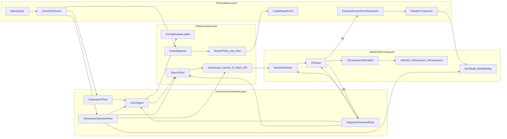

# Android Dynamic UI 架构图

## 分层架构（Llm UI + Dynamic UI）

## 说明

- Presentation：页面入口、交互、动态组件渲染。
- Domain：生成 UI、解析失败修复、提交用户选择总结等流程编排。
- Data：JSON 清洗、解析、组件模型与用户输入状态聚合。
- Infrastructure：提示词加载、Qwen API 访问、崩溃捕获与持久化。
