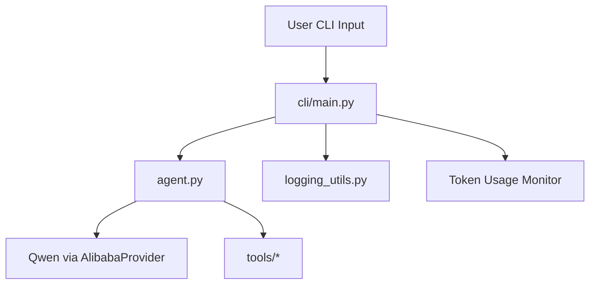

# 架构设计说明

本文描述 `agent1` 的核心分层、数据流和设计取舍。

## 1. 分层视图

### 层职责

- `cli/`：输入输出控制、会话管理、状态展示、token 预算保护
- `agent.py`：模型与 provider 配置、系统提示词注入
- `tools/`：外部能力（Shell / Python）
- `logging_utils.py`：JSONL 事件落盘

## 2. 运行流程

1. CLI 接收用户输入
2. 写入 `run_started` 与 `model_request` 事件
3. 调用 `agent.run_sync(...)` 或 `agent.run_stream_events(...)`
4. 若模型触发工具调用，记录 `tool_call` / `tool_result`
5. 输出模型响应并记录 `model_response`
6. 统计 usage，输出 token 表格，记录 `usage`
7. 结束时记录 `run_completed`（异常则 `run_failed`）

## 3. 可观测性设计

日志文件采用 JSONL，适合：

- `tail -f` 实时观察
- log shipper 按行采集
- 后续接入 ELK/ClickHouse/DataDog

每个事件包含：

- `ts`：UTC 时间戳
- `event_type`：事件类型
- `run_id`：同一轮对话追踪 ID
- 事件特定字段（如 `tool_name`, `usage` 等）

## 4. 跨平台设计

- Python 子进程统一使用 `sys.executable`
- Shell 执行按 OS 分流：
  - Windows：PowerShell
  - Unix-like：bash/sh
- 系统提示词自动注入运行环境，减少模型输出错误命令概率

## 5. 约束与已知问题

- 工具执行策略当前偏开放，仍需加强安全边界
- 单仓库暂未包含自动化测试

## 6. 演进建议

- 接入测试体系（单元测试 + golden case）
- 引入工具权限策略（命令白名单/危险操作确认）
- 提供可配置的日志级别与采样策略
- 增加多模型 fallback 与重试策略
