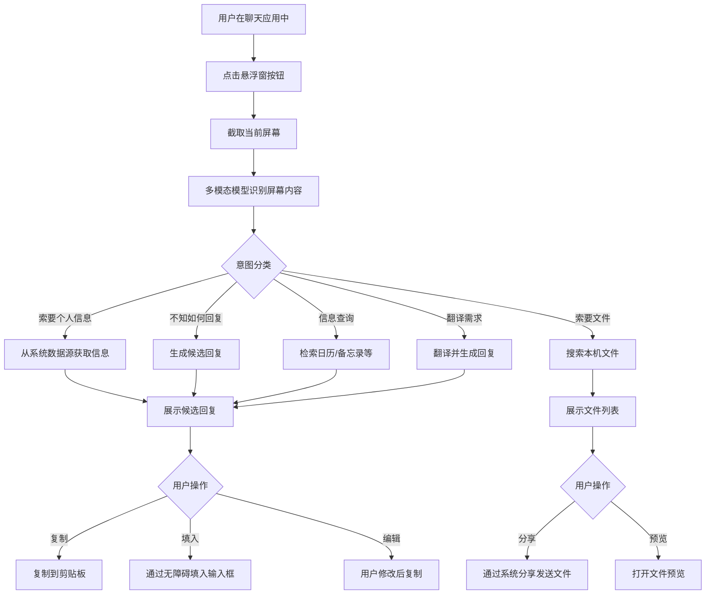
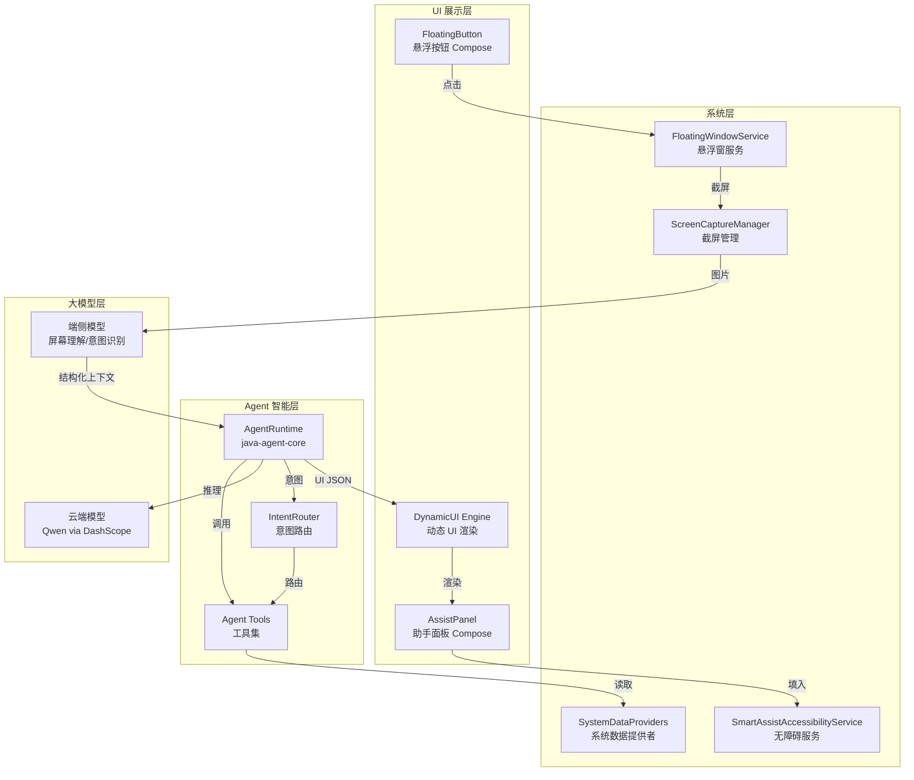
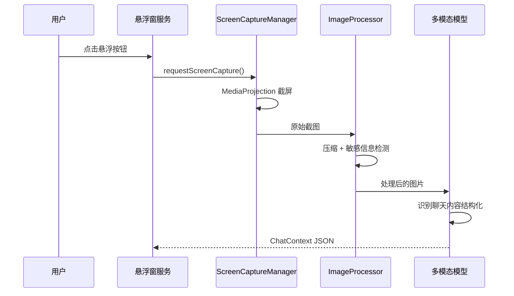
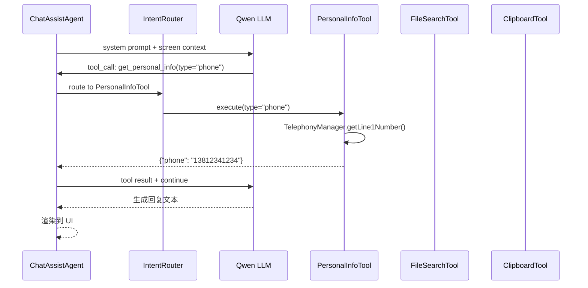
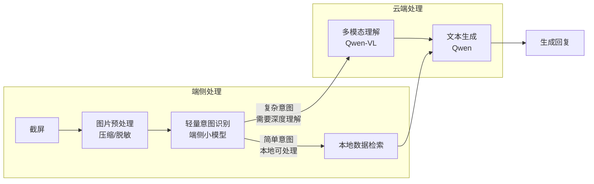

# 聊天智能助手（Chat Smart Assistant）

## 功能定位

聊天智能助手是一个运行在 Android 系统层的**悬浮窗服务**，在用户使用任意聊天应用（微信、钉钉、短信等）时，通过截屏识别当前聊天上下文，结合设备端大模型能力和系统级数据源，为用户**快速生成回复内容、查找并分享文件、提供个人信息**。

作为手机厂商的系统级应用，拥有普通第三方 App 无法获取的底层权限与数据，使其能提供更精准、更便捷的辅助体验。

---

# 第一部分：需求设计

## 1. 用户场景与故事

### 场景一：对方索要个人信息

> 用户在微信中与某人聊天，对方发送"请把你的电话号码发给我"。
>
> 用户点击悬浮窗按钮 → 助手自动截屏并识别聊天内容 → 检测到"索要电话号码"意图 → 从系统通讯录/SIM 卡信息中获取用户本机号码 → 生成回复"我的电话号码是 138xxxx1234" → 用户确认后一键复制到剪贴板或直接填入输入框。

### 场景二：对方索要文件

> 对方发送"xx 文件发我一下"。
>
> 用户点击悬浮窗 → 助手识别到"索要文件"意图 → 在本机文件系统中搜索匹配文件 → 列出候选文件（按相关性排序）→ 用户选中文件后通过系统分享接口发送。

### 场景三：不知道如何回复

> 用户聊天聊到一半，不确定如何得体地回复对方。
>
> 用户点击悬浮窗 → 助手截屏识别上下文 → 分析对话主题、情绪、对方诉求 → 生成 2~3 条候选回复（不同语气/风格）→ 用户选择一条，一键复制。

### 场景四：快速查询并回复

> 对方问"明天几点开会？" 或 "上次聚餐的地址是什么？"。
>
> 助手截屏识别 → 检测到信息查询意图 → 从日历、备忘录、历史消息等系统数据源中检索 → 生成回复。

### 场景五：翻译与润色

> 用户在与外国朋友聊天，对方发来英文消息，用户需要理解含义并用英文回复。
>
> 助手截屏识别 → 翻译对方消息为中文展示 → 用户用中文输入回复意图 → 助手翻译为英文 → 一键复制。

## 2. 功能清单

### 2.1 核心功能（P0）

| 编号 | 功能 | 说明 |
|------|------|------|
| F-01 | 悬浮窗入口 | 全局悬浮窗按钮，支持拖拽、自动贴边、透明度自适应 |
| F-02 | 屏幕内容捕获 | 截取当前屏幕，通过多模态大模型识别聊天内容 |
| F-03 | 意图识别 | 分析对话上下文，识别"索要信息/索要文件/求助回复/信息查询"等意图类别 |
| F-04 | 智能回复生成 | 根据上下文生成 1~3 条候选回复，支持不同语气风格 |
| F-05 | 个人信息检索 | 从 SIM 卡、通讯录、系统设置中提取用户个人信息（电话、邮箱、地址等） |
| F-06 | 文件检索与分享 | 在本机搜索匹配文件，支持预览和通过系统分享发送 |
| F-07 | 一键复制/填入 | 将生成的回复复制到剪贴板，或通过无障碍服务直接填入聊天输入框 |

### 2.2 增强功能（P1）

| 编号 | 功能 | 说明 |
|------|------|------|
| F-08 | 日历/备忘录检索 | 从系统日历、备忘录中检索信息辅助回复 |
| F-09 | 翻译与润色 | 多语言翻译、语气调整（正式/轻松/幽默） |
| F-10 | 对话上下文追踪 | 多次截屏合并，理解更长的对话历史 |
| F-11 | 自定义快捷回复模板 | 用户预设常用回复模板，如"稍后回复你"等 |
| F-12 | 回复历史记录 | 记录助手生成过的回复，便于复用 |

### 2.3 后续规划（P2）

| 编号 | 功能 | 说明 |
|------|------|------|
| F-13 | 语音输入 | 用户语音描述回复意图，助手生成文字回复 |
| F-14 | 多应用适配 | 深度适配微信、钉钉、飞书、短信等主流聊天应用 |
| F-15 | 学习用户风格 | 分析用户历史回复，模仿用户的语言风格生成回复 |
| F-16 | 主动提醒 | 检测到未回复消息超时时主动提醒用户 |

## 3. 交互设计

### 3.1 悬浮窗 UI

```
┌──────────────────────────────────────┐
│          当前聊天应用界面              │
│                                      │
│  ┌──────────────────────────┐        │
│  │ 对方：请把你的电话发给我    │        │
│  └──────────────────────────┘        │
│                                      │
│                          ┌───┐       │
│                          │ AI│ ← 悬浮按钮
│                          └───┘       │
└──────────────────────────────────────┘
```

**点击悬浮按钮后展开助手面板：**

```
┌──────────────────────────────────────┐
│  ┌────────────────────────────────┐  │
│  │  🤖 智能助手                ✕  │  │
│  ├────────────────────────────────┤  │
│  │                                │  │
│  │  检测到对方在索要您的电话号码   │  │
│  │                                │  │
│  │  ┌──────────────────────────┐  │  │
│  │  │ 我的电话是 138xxxx1234    │  │  │
│  │  │                 [复制]   │  │  │
│  │  └──────────────────────────┘  │  │
│  │                                │  │
│  │  ┌──────────────────────────┐  │  │
│  │  │ 你好，我的手机号：        │  │  │
│  │  │ 138xxxx1234，请查收       │  │  │
│  │  │                 [复制]   │  │  │
│  │  └──────────────────────────┘  │  │
│  │                                │  │
│  │  ────────────────────────────  │  │
│  │  [📎 更多工具]  [⚙ 设置]      │  │
│  └────────────────────────────────┘  │
└──────────────────────────────────────┘
```

### 3.2 文件搜索结果展示

```
┌────────────────────────────────────┐
│  🤖 智能助手                    ✕  │
├────────────────────────────────────┤
│                                    │
│  检测到对方在索要文件               │
│  关键词："项目方案"                 │
│                                    │
│  📄 项目方案v3.docx                │
│     下载/文档  12.3MB  今天 10:30  │
│     [预览]  [分享]                 │
│                                    │
│  📄 项目方案v2.pdf                 │
│     下载/文档  8.1MB  昨天 15:20   │
│     [预览]  [分享]                 │
│                                    │
│  📄 项目方案初稿.docx              │
│     下载/文档  5.7MB  3天前        │
│     [预览]  [分享]                 │
│                                    │
│  ────────────────────────────────  │
│  [🔍 搜索更多]  [⚙ 设置]          │
└────────────────────────────────────┘
```

### 3.3 交互流程



## 4. 数据源定义

作为手机厂商系统级应用，可访问的数据源：

| 数据源 | 数据类型 | 获取方式 | 权限要求 |
|--------|---------|---------|---------|
| SIM 卡信息 | 本机号码 | TelephonyManager | READ_PHONE_STATE |
| 系统通讯录 | 联系人、电话、邮箱 | ContactsContract | READ_CONTACTS |
| 文件系统 | 文档、图片、视频 | MediaStore / SAF | READ_EXTERNAL_STORAGE |
| 系统日历 | 日程、会议 | CalendarContract | READ_CALENDAR |
| 系统设置 | 用户名、设备信息 | Settings.System | 系统级 |
| 剪贴板 | 历史复制内容 | ClipboardManager | 系统级 |
| 通知 | 未读消息 | NotificationListenerService | BIND_NOTIFICATION_LISTENER |
| 最近任务 | 应用使用记录 | UsageStatsManager | PACKAGE_USAGE_STATS |
| 厂商云服务 | 云备忘录、云文件 | 厂商私有 API | 系统级 |

## 5. 安全与隐私

### 5.1 原则

- **最小权限**：仅在用户主动触发时才访问相关数据源，不后台静默收集
- **本地优先**：屏幕内容识别和个人信息提取优先在设备端完成，减少网络传输
- **用户知情**：每次截屏和数据访问都有明确的用户操作触发和视觉提示
- **数据不留存**：截屏图片仅用于当次识别，识别完成后立即销毁

### 5.2 安全措施

| 措施 | 说明 |
|------|------|
| 首次使用授权 | 首次使用前弹出权限说明页，用户明确授权后才启用 |
| 敏感信息脱敏 | 发送到云端模型的截图中脱敏银行卡号、身份证号等 |
| 本地加密 | 用户个人信息缓存使用 Android Keystore 加密 |
| 使用记录 | 用户可查看助手的数据访问记录 |
| 一键关闭 | 用户可随时在设置中关闭智能助手全部功能 |
| 应用白名单 | 用户可设置仅在指定应用中启用助手 |

---

# 第二部分：技术方案

## 1. 系统架构总览



## 2. 模块设计

### 2.1 模块依赖关系

```
com.agent1.smartassist/
├── service/                    # 系统服务层
│   ├── FloatingWindowService   # 悬浮窗管理服务
│   ├── ScreenCaptureManager    # 屏幕截取
│   └── SmartAssistAccessibility# 无障碍服务（填入内容）
├── agent/                      # 智能 Agent 层
│   ├── ChatAssistAgent         # 聊天助手 Agent（基于 java-agent-core）
│   ├── IntentRouter            # 意图路由器
│   └── tools/                  # Agent 工具集
│       ├── ScreenAnalyzeTool   # 截屏分析工具
│       ├── PersonalInfoTool    # 个人信息检索工具
│       ├── FileSearchTool      # 文件搜索工具
│       ├── CalendarQueryTool   # 日历查询工具
│       ├── ContactSearchTool   # 联系人搜索工具
│       ├── ClipboardTool       # 剪贴板操作工具
│       └── TranslateTool       # 翻译工具
├── data/                       # 数据层
│   ├── SystemDataProvider      # 系统数据统一访问接口
│   ├── UserProfileStore        # 用户画像本地存储
│   └── ReplyHistoryStore       # 回复历史存储（SQLite）
├── ui/                         # UI 层
│   ├── FloatingButtonCompose   # 悬浮按钮
│   ├── AssistPanelCompose      # 助手面板
│   ├── ReplyCardCompose        # 回复候选卡片
│   ├── FileListCompose         # 文件列表
│   └── SettingsScreenCompose   # 设置页面
└── util/                       # 工具层
    ├── ImageProcessor          # 图片预处理（压缩/脱敏）
    ├── PermissionHelper        # 权限管理
    └── EncryptionHelper        # 数据加密
```

### 2.2 与现有项目的关系

本功能基于现有仓库的以下模块构建：

| 现有模块 | 复用方式 | 说明 |
|---------|---------|------|
| `java-agent-core` | Agent 运行时核心 | `ChatAssistAgent` 直接基于 `AgentRuntime` 构建，复用事件流、工具调用循环、流式 LLM 交互 |
| `agent_ui` Dynamic UI | UI 渲染引擎 | 助手面板中的回复展示、文件列表等通过 LLM 生成 JSON → Compose 渲染 |
| `OpenAiCompatibleClient` | LLM 通信 | 复用现有的 DashScope/OpenAI 兼容客户端 |
| `MemorySqliteCatalog` | 持久化记忆 | 存储用户偏好和回复历史 |

## 3. 核心流程详细设计

### 3.1 截屏与内容识别



**截屏识别的 Prompt 设计：**

```
你是一个屏幕内容分析助手。请分析这张聊天应用的截图，提取以下信息：

1. 当前聊天应用名称
2. 聊天对象（昵称/备注名）
3. 最近的对话内容（按时间顺序，标注发送方）
4. 最后一条消息的发送方和内容
5. 对方的意图分类（以下之一）：
   - REQUEST_PERSONAL_INFO: 索要个人信息（电话、邮箱、地址等）
   - REQUEST_FILE: 索要文件
   - NEED_REPLY_HELP: 用户可能需要回复帮助
   - QUERY_INFO: 查询某个信息
   - TRANSLATION: 需要翻译
   - OTHER: 其他

请以 JSON 格式输出：
{
  "app": "微信",
  "chat_target": "张三",
  "messages": [
    {"sender": "张三", "content": "请把你的电话号码发给我", "time": "10:30"}
  ],
  "last_message": {"sender": "张三", "content": "请把你的电话号码发给我"},
  "intent": "REQUEST_PERSONAL_INFO",
  "intent_detail": {"info_type": "phone_number"},
  "suggested_action": "查找用户本机电话号码并生成回复"
}
```

### 3.2 Agent 工具调用流程



### 3.3 Agent Tools 定义

每个工具遵循 `java-agent-core` 的 `AgentTool` 接口：

```java
public class PersonalInfoTool implements AgentTool {
    @Override
    public String getName() { return "get_personal_info"; }

    @Override
    public String getDescription() {
        return "获取用户的个人信息。支持的信息类型：phone（电话号码）、"
             + "email（邮箱）、address（地址）、name（姓名）";
    }

    @Override
    public JsonNode getParameterSchema() {
        // {"type": "object", "properties": {"info_type": {"type": "string", "enum": [...]}}}
    }

    @Override
    public ToolExecutionResult execute(String argumentsJson) {
        // 从 SystemDataProvider 获取对应信息
    }
}
```

```java
public class FileSearchTool implements AgentTool {
    @Override
    public String getName() { return "search_files"; }

    @Override
    public String getDescription() {
        return "在用户手机上搜索文件。支持按文件名关键词、文件类型、"
             + "时间范围搜索。返回匹配的文件列表及其路径、大小、修改时间。";
    }

    @Override
    public ToolExecutionResult execute(String argumentsJson) {
        // 通过 MediaStore 查询匹配文件
    }
}
```

```java
public class CalendarQueryTool implements AgentTool {
    @Override
    public String getName() { return "query_calendar"; }

    @Override
    public String getDescription() {
        return "查询用户的日历日程。支持按时间范围、关键词搜索。"
             + "返回匹配的日程事件列表。";
    }

    @Override
    public ToolExecutionResult execute(String argumentsJson) {
        // 通过 CalendarContract 查询日程
    }
}
```

### 3.4 悬浮窗服务实现

```kotlin
class FloatingWindowService : Service() {

    private lateinit var windowManager: WindowManager
    private lateinit var agentRuntime: AgentRuntime
    private var floatingView: ComposeView? = null

    override fun onCreate() {
        super.onCreate()
        windowManager = getSystemService(WINDOW_SERVICE) as WindowManager
        initAgent()
        showFloatingButton()
    }

    private fun initAgent() {
        val client = OpenAiCompatibleClient(
            baseUrl = BuildConfig.DASHSCOPE_BASE_URL,
            apiKey = BuildConfig.DASHSCOPE_API_KEY,
            model = "qwen-vl-max"  // 多模态模型用于截屏识别
        )

        agentRuntime = AgentRuntime.builder()
            .client(client)
            .systemPrompt(ChatAssistSystemPrompt.build())
            .addTool(PersonalInfoTool(this))
            .addTool(FileSearchTool(this))
            .addTool(CalendarQueryTool(this))
            .addTool(ContactSearchTool(this))
            .addTool(TranslateTool())
            .build()
    }

    private fun showFloatingButton() {
        val params = WindowManager.LayoutParams(
            WindowManager.LayoutParams.WRAP_CONTENT,
            WindowManager.LayoutParams.WRAP_CONTENT,
            WindowManager.LayoutParams.TYPE_APPLICATION_OVERLAY,
            WindowManager.LayoutParams.FLAG_NOT_FOCUSABLE,
            PixelFormat.TRANSLUCENT
        ).apply {
            gravity = Gravity.END or Gravity.CENTER_VERTICAL
            x = 0
            y = 0
        }

        floatingView = ComposeView(this).apply {
            setContent {
                FloatingAssistButton(
                    onClick = { onAssistTriggered() },
                    onDrag = { dx, dy -> updatePosition(params, dx, dy) }
                )
            }
        }

        windowManager.addView(floatingView, params)
    }

    private fun onAssistTriggered() {
        ScreenCaptureManager.capture(this) { bitmap ->
            val processed = ImageProcessor.prepareForLLM(bitmap)
            showAssistPanel(processed)
        }
    }
}
```

### 3.5 无障碍服务（内容填入）

```kotlin
class SmartAssistAccessibilityService : AccessibilityService() {

    companion object {
        private var instance: SmartAssistAccessibilityService? = null

        fun pasteToCurrentInput(text: String): Boolean {
            return instance?.performPaste(text) ?: false
        }
    }

    override fun onAccessibilityEvent(event: AccessibilityEvent?) {
        // 监听当前焦点窗口变化，追踪聊天应用输入框
    }

    override fun onInterrupt() {}

    override fun onServiceConnected() {
        instance = this
    }

    private fun performPaste(text: String): Boolean {
        val rootNode = rootInActiveWindow ?: return false
        val inputNode = findInputField(rootNode) ?: return false

        val args = Bundle().apply {
            putCharSequence(
                AccessibilityNodeInfo.ACTION_ARGUMENT_SET_TEXT_CHARSEQUENCE,
                text
            )
        }
        return inputNode.performAction(AccessibilityNodeInfo.ACTION_SET_TEXT, args)
    }

    private fun findInputField(root: AccessibilityNodeInfo): AccessibilityNodeInfo? {
        if (root.isEditable && root.className == "android.widget.EditText") {
            return root
        }
        for (i in 0 until root.childCount) {
            val child = root.getChild(i) ?: continue
            val result = findInputField(child)
            if (result != null) return result
        }
        return null
    }
}
```

## 4. System Prompt 设计

### 4.1 ChatAssistAgent 的 System Prompt

```
你是一个运行在用户手机上的聊天智能助手。你的职责是帮助用户快速回复聊天消息。

## 你的能力

你可以使用以下工具：
- get_personal_info: 获取用户个人信息（电话、邮箱、地址等）
- search_files: 在手机上搜索文件
- query_calendar: 查询日历日程
- search_contacts: 搜索联系人信息
- translate: 翻译文本

## 工作流程

1. 你会收到用户当前聊天屏幕的分析结果，包含对话内容和对方意图
2. 根据意图，主动调用合适的工具获取需要的信息
3. 生成 2~3 条候选回复供用户选择
4. 回复应自然、得体，匹配对话的语气和场景

## 回复原则

- 如果对方索要个人信息，先调用 get_personal_info 获取，再组织成自然语言
- 如果对方索要文件，调用 search_files 搜索，返回文件列表而非文字回复
- 如果用户不知如何回复，结合上下文生成多条风格不同的候选回复
- 回复要简洁自然，像正常聊天，不要过于正式或机械
- 涉及敏感信息时提醒用户确认后再发送

## 输出格式

以 JSON 格式输出结果：
{
  "intent": "识别到的意图",
  "replies": [
    {"text": "候选回复1", "style": "简洁"},
    {"text": "候选回复2", "style": "礼貌"}
  ],
  "files": [],       // 仅文件搜索时有值
  "confidence": 0.9, // 置信度
  "note": "给用户的提示信息，如：已找到您的电话号码"
}
```

## 5. 端侧与云端协同策略



### 策略说明

| 场景 | 处理方式 | 理由 |
|------|---------|------|
| 索要电话号码/邮箱等明确信息 | 端侧意图识别 + 本地数据检索 + 端侧生成 | 隐私敏感，减少网络传输 |
| 索要文件 | 端侧意图识别 + 本地文件搜索 | 文件搜索无需云端 |
| 复杂对话理解/回复生成 | 云端多模态模型 | 需要深层语义理解 |
| 翻译 | 云端模型 | 翻译质量依赖大模型能力 |

## 6. 多模态截屏识别方案

### 6.1 方案选型

| 方案 | 优点 | 缺点 | 选择 |
|------|------|------|------|
| A. 直接将截图发给多模态大模型 | 实现简单，理解准确 | 网络依赖，延迟较高 | P0 阶段采用 |
| B. 端侧 OCR + 云端文本理解 | 减少传输量 | 两阶段可能丢失上下文 | P1 备选 |
| C. 无障碍服务直接读取界面元素 | 无需截屏，实时性好 | 依赖应用 UI 结构，兼容性差 | P2 辅助 |

**P0 阶段采用方案 A**：直接将压缩后的截图发给 Qwen-VL 多模态模型，一步完成内容识别和意图分类。

### 6.2 图片预处理

```kotlin
object ImageProcessor {
    fun prepareForLLM(bitmap: Bitmap): ByteArray {
        val scaled = scaleTo(bitmap, maxWidth = 1080, maxHeight = 1920)

        val masked = maskSensitiveAreas(scaled)

        val stream = ByteArrayOutputStream()
        masked.compress(Bitmap.CompressFormat.JPEG, 80, stream)
        return stream.toByteArray()
    }

    private fun maskSensitiveAreas(bitmap: Bitmap): Bitmap {
        // 利用端侧 OCR 检测银行卡号、身份证号等模式
        // 对匹配区域进行马赛克处理
        return bitmap
    }
}
```

## 7. 数据存储设计

### 7.1 用户偏好（SharedPreferences + 加密）

```kotlin
data class UserPreferences(
    val enabledApps: Set<String>,          // 启用的应用包名白名单
    val defaultReplyStyle: String,         // 默认回复风格
    val autoFillEnabled: Boolean,          // 是否启用自动填入
    val sensitiveInfoConfirm: Boolean,     // 敏感信息是否需要确认
    val floatingButtonPosition: Position,  // 悬浮按钮位置
    val floatingButtonOpacity: Float       // 悬浮按钮透明度
)
```

### 7.2 回复历史（SQLite，复用 MemorySqliteCatalog 模式）

```sql
CREATE TABLE reply_history (
    id INTEGER PRIMARY KEY AUTOINCREMENT,
    timestamp INTEGER NOT NULL,
    app_package TEXT,
    chat_target TEXT,
    intent TEXT,
    screen_context TEXT,
    generated_replies TEXT,     -- JSON array
    selected_reply TEXT,
    user_edited INTEGER DEFAULT 0,
    created_at TEXT DEFAULT (datetime('now'))
);

CREATE INDEX idx_reply_history_app ON reply_history(app_package);
CREATE INDEX idx_reply_history_target ON reply_history(chat_target);
CREATE INDEX idx_reply_history_timestamp ON reply_history(timestamp);
```

## 8. 权限与系统集成

### 8.1 所需权限

```xml
<!-- AndroidManifest.xml -->

<!-- 悬浮窗 -->
<uses-permission android:name="android.permission.SYSTEM_ALERT_WINDOW" />

<!-- 截屏 -->
<uses-permission android:name="android.permission.FOREGROUND_SERVICE_MEDIA_PROJECTION" />

<!-- 个人信息 -->
<uses-permission android:name="android.permission.READ_PHONE_STATE" />
<uses-permission android:name="android.permission.READ_CONTACTS" />

<!-- 文件搜索 -->
<uses-permission android:name="android.permission.READ_EXTERNAL_STORAGE" />
<uses-permission android:name="android.permission.READ_MEDIA_IMAGES" />
<uses-permission android:name="android.permission.READ_MEDIA_VIDEO" />
<uses-permission android:name="android.permission.READ_MEDIA_AUDIO" />

<!-- 日历 -->
<uses-permission android:name="android.permission.READ_CALENDAR" />

<!-- 网络 -->
<uses-permission android:name="android.permission.INTERNET" />

<!-- 前台服务 -->
<uses-permission android:name="android.permission.FOREGROUND_SERVICE" />
```

### 8.2 无障碍服务声明

```xml
<!-- res/xml/accessibility_service_config.xml -->
<accessibility-service
    xmlns:android="http://schemas.android.com/apk/res/android"
    android:accessibilityEventTypes="typeWindowStateChanged|typeWindowContentChanged"
    android:accessibilityFeedbackType="feedbackGeneric"
    android:accessibilityFlags="flagRetrieveInteractiveWindows|flagIncludeNotImportantViews"
    android:canRetrieveWindowContent="true"
    android:notificationTimeout="100"
    android:description="@string/accessibility_service_description" />
```

### 8.3 作为系统应用的额外能力

由于是手机厂商系统应用，可通过以下方式获得增强能力：

| 能力 | 实现方式 | 普通应用是否可用 |
|------|---------|----------------|
| 免授权截屏 | 系统签名 + `CAPTURE_SCREEN` 权限 | 否 |
| 读取任意应用 UI 树 | 系统签名 AccessibilityService | 需用户手动开启 |
| 直接读取 SIM 信息 | 系统签名 + `READ_PRIVILEGED_PHONE_STATE` | 否 |
| 文件全局搜索 | 系统签名 + `MANAGE_EXTERNAL_STORAGE` | Android 11+ 受限 |
| 通知读取 | `BIND_NOTIFICATION_LISTENER_SERVICE` | 需用户手动开启 |
| 后台常驻 | 系统应用免杀 | 否 |

## 9. 性能与体验优化

### 9.1 响应时间目标

| 阶段 | 目标耗时 | 优化手段 |
|------|---------|---------|
| 截屏 | < 200ms | MediaProjection 直接捕获 |
| 图片预处理 | < 100ms | GPU 加速压缩 |
| 屏幕内容识别 | < 2s | 多模态模型并行调用；端侧预判 |
| 工具调用 | < 500ms | 本地数据检索，无网络延迟 |
| 回复生成 | < 2s | 流式输出，首 token 即开始展示 |
| **端到端** | **< 3~5s** | 流式体验：截屏后立即展示加载动画 |

### 9.2 流式体验

```kotlin
agentRuntime.subscribe { event ->
    when (event.type) {
        AgentEventType.AGENT_START -> showLoadingAnimation()
        AgentEventType.MESSAGE_UPDATE -> {
            // 增量更新 UI，每收到一个 delta 就渲染
            updateAssistPanel(event.payload.delta)
        }
        AgentEventType.TOOL_EXECUTION_START -> {
            showToolProgress(event.payload.toolName)
        }
        AgentEventType.AGENT_END -> hideLoadingAnimation()
    }
}
```

### 9.3 缓存策略

- **用户信息缓存**：电话号码、邮箱等基本不变的信息启动时加载并加密缓存，避免每次都读取
- **文件索引缓存**：维护常用文件的索引，减少 MediaStore 查询
- **模型预热**：应用启动时预加载模型连接，减少首次调用延迟

## 10. 分阶段实施计划

### Phase 1：MVP（核心可用）

**范围**：悬浮窗 + 截屏识别 + 智能回复生成 + 一键复制

- 实现 `FloatingWindowService` 与悬浮按钮 UI
- 实现 `ScreenCaptureManager` 截屏
- 集成 Qwen-VL 多模态模型做屏幕内容识别
- 基于 `java-agent-core` 构建 `ChatAssistAgent`
- 实现 `PersonalInfoTool`（电话、邮箱）
- 实现基本回复生成与展示面板
- 支持一键复制到剪贴板

**交付件**：可安装的系统应用 APK，在微信场景下完成"索要电话"和"帮我回复"两个核心场景

### Phase 2：工具增强

**范围**：文件搜索 + 日历查询 + 无障碍填入

- 实现 `FileSearchTool` 与文件列表 UI
- 实现 `CalendarQueryTool` 日历检索
- 实现 `SmartAssistAccessibilityService` 自动填入
- 对话上下文追踪（多次截屏合并）
- 回复历史记录

### Phase 3：体验优化

**范围**：端侧优化 + 多应用适配 + 个性化

- 端侧轻量意图识别模型，减少云端依赖
- 敏感信息脱敏增强
- 多应用深度适配（微信/钉钉/飞书/短信）
- 用户回复风格学习
- 快捷模板系统

### Phase 4：高级特性

**范围**：语音 + 主动提醒 + 更多数据源

- 语音输入回复意图
- 未回复消息超时提醒
- 云备忘录/云笔记检索
- 更多工具集成（地图导航、订餐等）

## 11. 关键技术风险与应对

| 风险 | 影响 | 应对措施 |
|------|------|---------|
| 多模态模型截屏识别准确率不够 | 意图误判导致错误回复 | 1. 增加置信度阈值，低于阈值时让用户手动选择意图；2. 多模型投票 |
| 截屏延迟影响体验 | 用户感知卡顿 | 1. 预截屏（检测到聊天应用在前台时预截一帧）；2. 加载动画过渡 |
| 不同聊天应用 UI 布局差异大 | 通用识别可能遗漏信息 | 1. 多模态模型天然适应不同布局；2. 针对高频应用做 prompt 微调 |
| 隐私合规风险 | 用户信任问题 | 1. 明确的权限授权流程；2. 数据不出端的优先策略；3. 用户可查看全部数据访问记录 |
| 系统权限变更 | Android 版本升级后权限收紧 | 1. 系统签名保底；2. 做好降级方案（功能降级但不崩溃） |

## 12. 测试策略

| 测试类型 | 覆盖范围 | 方法 |
|---------|---------|------|
| 单元测试 | 各 Tool 的数据解析逻辑 | JUnit + Mockito |
| 集成测试 | AgentRuntime + Tools 联调 | java-agent-core 测试框架 |
| UI 测试 | 悬浮窗交互、面板展示 | Compose UI Testing |
| 场景测试 | 微信/钉钉/短信核心场景 | 真机手动测试矩阵 |
| 性能测试 | 端到端响应时间 | Android Profiler + 自定义埋点 |
| 隐私测试 | 数据不泄露/脱敏正确性 | 安全审计 + 抓包验证 |
