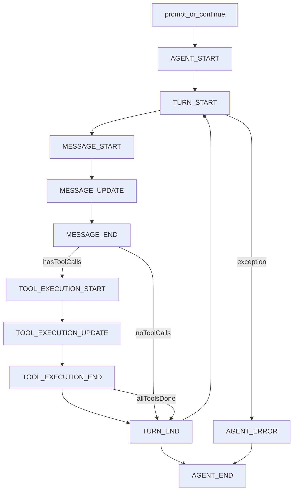

# Java Agent 架构（MVP）

## 目标

`java_agent` 在 Java 侧复刻 `pi-agent-core` 的 MVP 运行时能力，优先支持：

- 状态化 Agent
- 流式事件回调
- 工具调用循环
- continue / abort
- OpenAI 兼容协议（OpenAI + 阿里兼容端）

## 模块结构

- `java_agent/src/main/java/com/agent1/javaagent/core`
  - `AgentRuntime`：主循环与并发控制
  - `AgentState`：运行时状态
  - `AgentOptions`：初始化配置
- `java_agent/src/main/java/com/agent1/javaagent/event`
  - `AgentEvent` / `AgentEventType` / `EventPayloads`
- `java_agent/src/main/java/com/agent1/javaagent/tool`
  - `AgentTool` 与工具执行结果/增量类型
- `java_agent/src/main/java/com/agent1/javaagent/llm/openai`
  - `OpenAiCompatibleClient`（SSE 流式）

## 事件时序

## OpenAI 兼容策略

- 统一请求地址：`{baseUrl}/chat/completions`
- 开启 `stream=true`，按 SSE `data:` 增量解析
- 消息映射：
  - `user/system/assistant` -> OpenAI messages
  - `toolResult` -> role=`tool`, `tool_call_id`
- 工具映射：
  - `AgentTool` -> OpenAI `tools[].function`
- 因为阿里大模型提供 OpenAI 兼容格式，所以通过 `baseUrl + model` 即可复用同一客户端

## 线程与取消模型

- `AgentRuntime` 使用单线程执行器，保证同一实例不并发污染状态
- `abort()` 通过 `CancellationToken` 中断 SSE 与工具执行
- `waitForIdle()` 可在外部等待当前运行完成

## 流式模型与 RxJava

- 保留原有回调订阅：`subscribe(AgentEventListener)`
- 新增 Rx 订阅：`observeEvents()` 返回 `Observable<AgentEvent>`
- 当前实现是轻量事件总线 + Rx 桥接（不是完整的自研 Rx 框架）
- 后续做多工具并发/多路合并时，可直接在上层使用 Rx 操作符组合事件流

## Android / PC 接入建议

- **PC CLI**：直接使用 `PcCliExample` 或按同模式封装命令行入口
- **Android**：
  - 在 `ViewModel` 中持有 `AgentRuntime`
  - 订阅 `MESSAGE_UPDATE` 做增量 UI 更新
  - 在生命周期结束时 `abort()` + `close()`

## 本期未实现（仅预留扩展点）

- steer / followUp 队列
- 高级 `transformContext` 压缩策略
- 多供应商专有协议分支（只做 OpenAI 兼容层）
